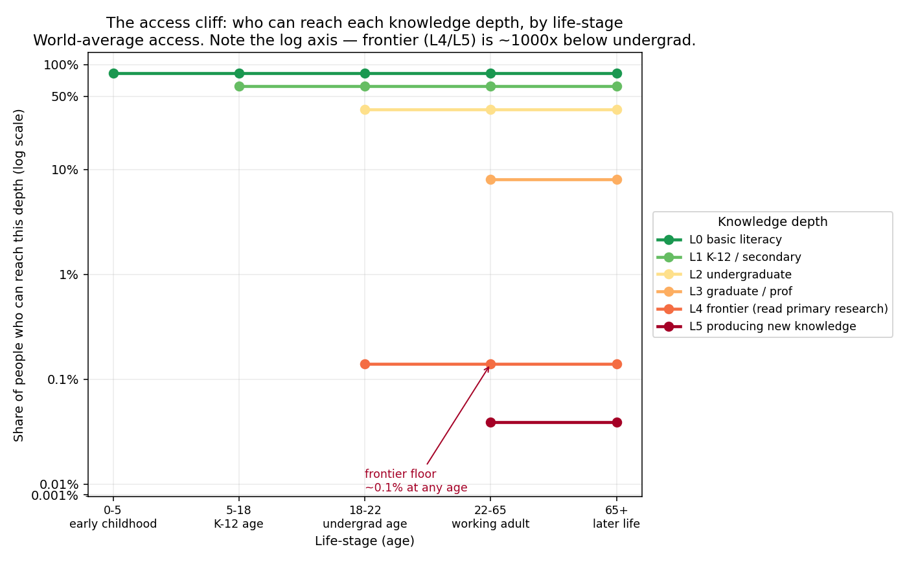
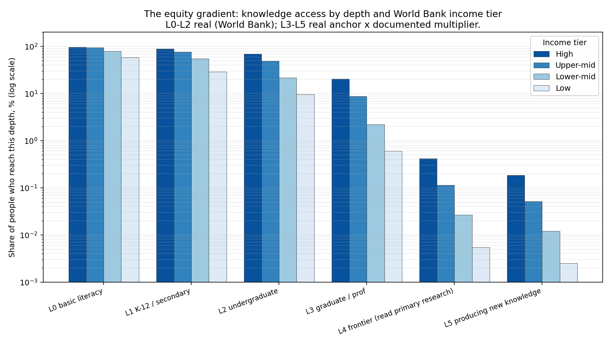
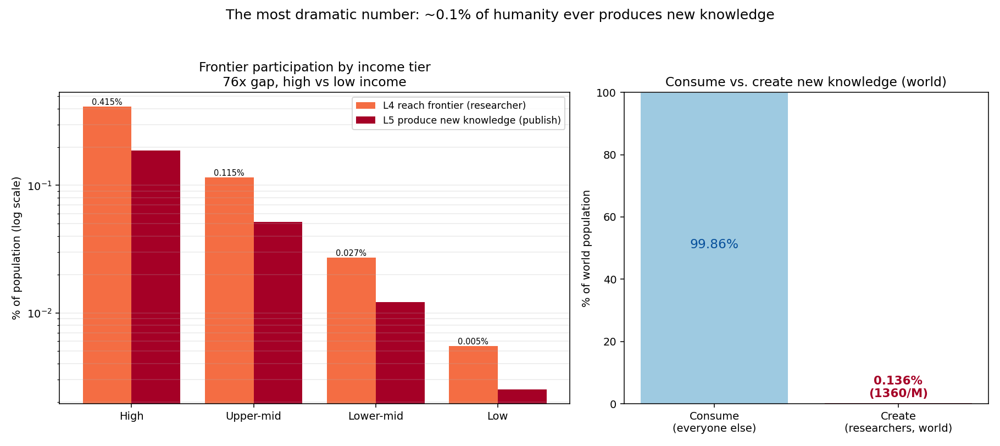
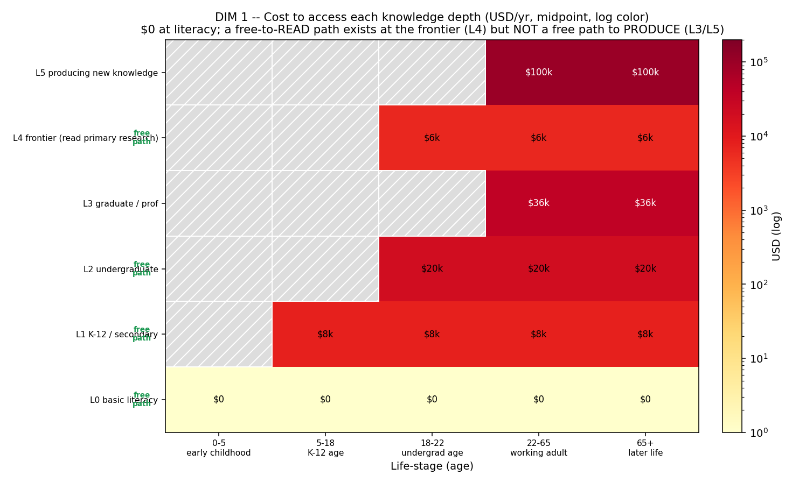
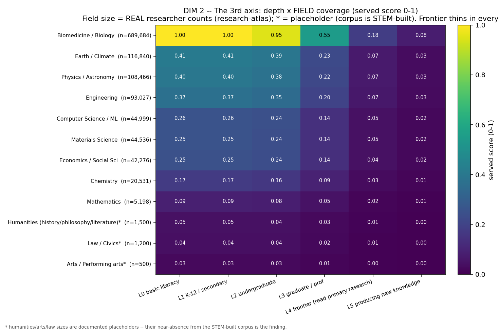
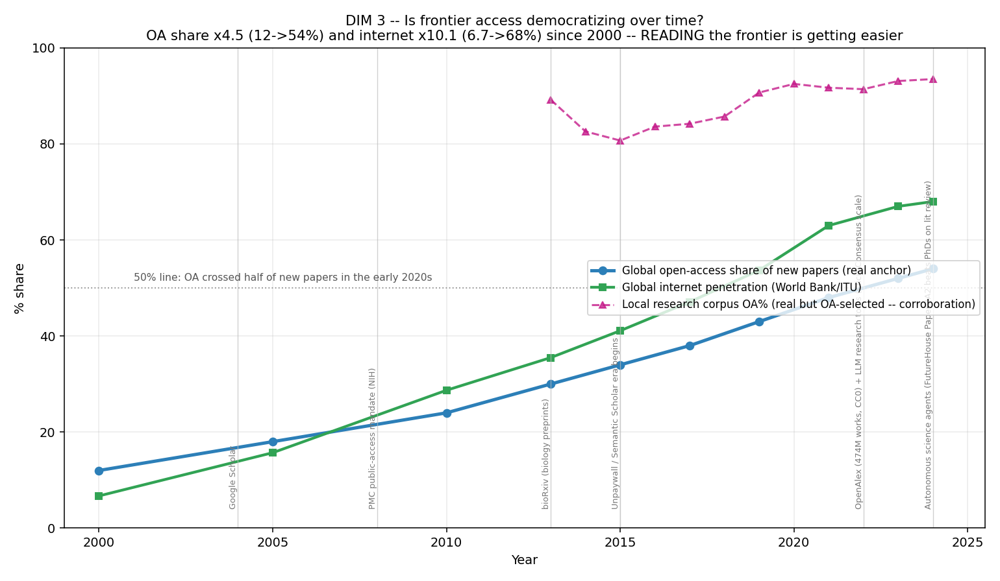
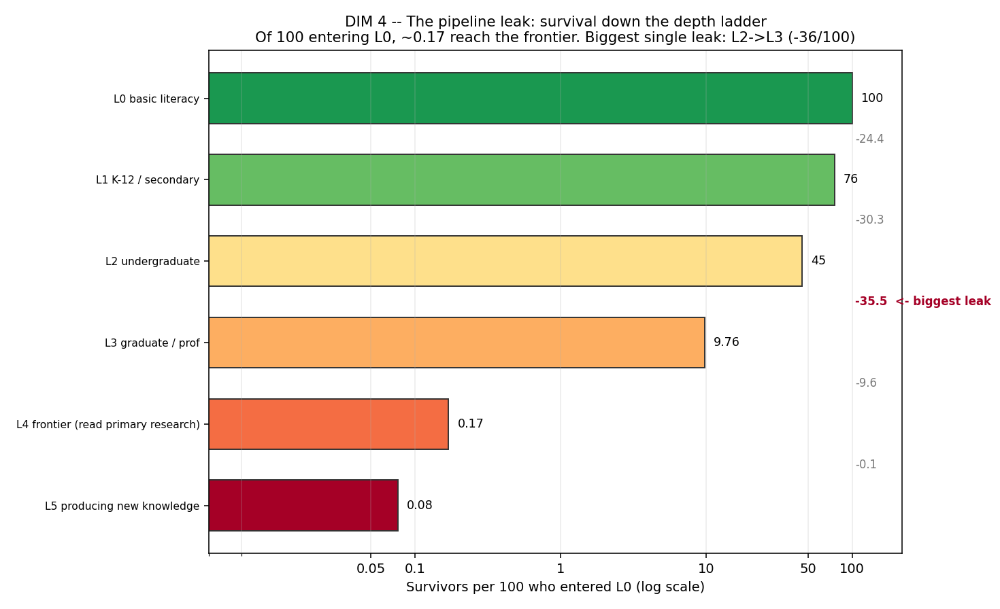
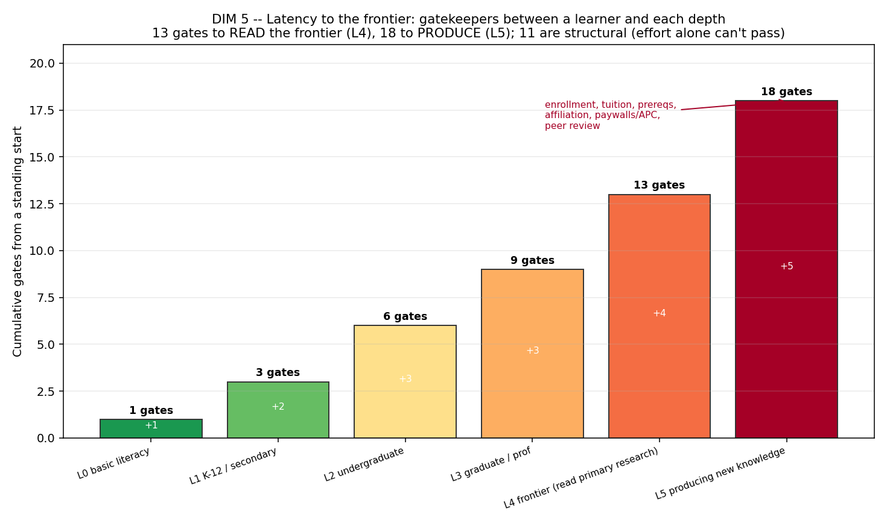

# The Knowledge-Access Gradient

### Who can reach how deep into human knowledge, at what age, at what cost — and what that means for reforming education

*education-atlas — the flagship synthesis. Gianangelo Dichio · Bucket Foundation · 2026-06-24.*

*This document consolidates the entire education-atlas corpus — the quantitative
problem atlas (`docs/EDUCATION_PROBLEMS.md`), the four structural deep-dives
(`docs/deep/01–04`), the four neutral foundations briefs (`docs/foundations/01–04`),
the four landscape briefs (`docs/landscape/01–04`), the reform thesis
(`docs/REFORM_THESIS.md`), and the reproducible analyses behind
`analysis/landscape/results.json` and `results_expansion.json` — into one
argument. Every headline number is traceable to one of those sources or to the
authoritative custodians they cite (World Bank EdStats, UNESCO UIS, OECD PISA,
ITU, OpenAlex/research-atlas, and the peer-reviewed learning-science literature).
Where a figure is constructed or estimated rather than measured, it is flagged as
such — the same evidence discipline the corpus holds throughout.*

---

## Abstract

The world has spent two centuries building a broad, shallow base of education and
almost none of a deep one. Measured against UN Sustainable Development Goal 4, the
record shows three stacked crises — a **learning** crisis (48.3% of 10-year-olds
worldwide cannot read a simple text; 86.5% in Sub-Saharan Africa), an **access**
crisis that has shrunk but moved up a level (51M primary-age and 61M
lower-secondary-age children out of school), and a **financing** crisis underwriting
both (world education spend is 3.6% of GDP, below the agreed 4% floor, with 92 of
~200 countries beneath it). But the deepest inequity is not visible in the access
statistics at all. When we lay knowledge access on a grid of **age × depth** — from
basic literacy (L0) up through undergraduate (L2), graduate (L3), reading the research
frontier (L4), and producing new knowledge (L5) — access does not fall gently. It
falls off a cliff down the depth axis: world access runs **82.5% at L0 → 37.4% at L2
→ 0.14% at L4 → 0.06% at L5**, a ~270× drop from undergraduate to the frontier, and
the rich-poor gap widens from under 2× at literacy to ~75× at the frontier. About
**99.86% of humanity only ever consumes knowledge; ~0.14% ever reaches the place where
it is produced.** The shape of that gradient has five expansion dimensions, and they
agree: the cost curve is bimodal (a free path exists to *read* but none to *produce*),
field coverage is wildly uneven (biomedicine has ~133× more researchers than
mathematics), the temporal trend is democratizing reading but not production, the
pipeline leaks worst at the undergraduate-to-graduate step, and a learner faces ~13
gates to read the frontier and ~18 to produce there, 11 of them structural barriers
effort alone cannot pass. The causes are structural: an industrial schooling model
built to *sort* rather than teach, a gatekeeping political economy in which academic
publishers earn ~38% margins on donated labor selling publicly funded work back to the
public, and a system that omits the highest-leverage capacities (learning-to-learn,
the body, the ceiling on the ablest). Yet the corpus's foundations layer insists on a
hard caveat that the data cannot override: **what education is *for* is an irreducible,
contested value question** — there is no single cross-civilizational definition of an
educated person, and sorting, credentialing, and socialization are legitimate
functions, not merely pathologies. So any reform is a value choice and must be stated
as one. The evidence on what works points to structured, human-mediated levers
(Teaching at the Right Level, tutoring at ~0.37 SD, metacognition) and against folk
theory (learning styles is null). The highest-leverage region for the *specific* goal
of opening advanced knowledge is the L3→L4→L5 zone: the comprehension bridge from
established knowledge to the frontier, an author-routed production economics, and
non-institutional, any-age frontier access. Bucket Foundation's open-knowledge thesis
is named here as **one defensible choice among the contested aims** — honestly bounded:
it does not fix K-12 funding, teacher pay, or the access and learning emergency in poor
states. The one-sentence finding: the world built a broad shallow base and a thin,
gated, unequal peak, and the deepest inequity and the emptiest market both sit at the
top — at frontier access and the ability to produce knowledge.

---

## 1. Introduction: the question under the question

Education debates almost always measure the wrong axis. They ask whether children are
*enrolled* — whether a body is in a classroom — and treat the answer as the score. By
that measure the world has largely won: primary enrollment is near-saturation in most
of the planet, and global adult literacy stands at 87.7%. The industrial expansion of
mass schooling was, on its own terms, one of the great democratizing achievements of
the modern era, and any honest account must concede that first (`docs/deep/02` §4.4).

But enrollment is a single point on a much larger surface. The harder question — the
one this atlas was built to answer — is: **for a person of a given age, how deep into a
body of knowledge can they actually go, at what cost, against how many gates; and what
fraction of humanity ever reaches the frontier where new knowledge is read, let alone
produced?** That reframing changes everything, because the failures invisible to the
enrollment statistic are exactly where the deepest inequities live.

To make the question tractable the corpus lays it on a two-dimensional grid
(`docs/landscape/02` §0; the axes are a constructed analytical frame defined in
`analysis/landscape/scale.py`, while the access proxies mapped to them are real data):

- **X — Age / life-stage:** `0–5` · `5–18` · `18–22` · `22–65` · `65+`.
- **Y — Knowledge depth,** a six-rung ladder:
  - **L0** basic literacy / numeracy
  - **L1** K-12 / secondary
  - **L2** undergraduate
  - **L3** graduate / professional
  - **L4** the frontier — *reading* primary, peer-reviewed and preprint research
  - **L5** *producing* new knowledge — actually doing research

The split between L4 and L5 — reaching the frontier versus adding to it — turns out to
be one of the load-bearing distinctions in the whole analysis, because the data shows
them as almost the same sliver, and because the one place a free path opens at the top
(reading) is precisely *not* the place the gradient is most closed (producing).

The reason this matters for *reform* is that a reform agenda is only as good as its map
of the terrain. If the binding constraint is age (when in life you get access), you
fund pre-K and lifelong learning. If it is depth (how far up the ladder you can climb),
you attack the cliff. If it is income (who can buy depth), you attack the gradient. The
rest of this document shows the binding constraint is depth, bought by income, gated by
institutions — and then asks, honestly, what a foundation can and cannot do about it.

---

## 2. The measurable state: three crises, an access cliff, and a consume-versus-create gap

### 2.1 Three crises stacked on top of each other

The quantitative atlas holds 78,326 observations across 219 countries and 30
indicators, scoring 5,036 country × level × indicator problem profiles against SDG 4
benchmarks (`docs/EDUCATION_PROBLEMS.md`). Read top to bottom it tells one story in
three layers.

The **learning crisis** is the deepest. Learning poverty — the share of 10-year-olds
who cannot read and understand a simple text — is **48.3% worldwide** (World Bank
`SE.LPV.PRIM`). Nearly half of all children reach age 10 unable to do the one thing
primary school exists to teach, and these are children *in school*. It is wildly
unequal: 86.5% in Sub-Saharan Africa against 8.6% in Europe & Central Asia — a tenfold
gap, and the single best predictor of whether a child can read at 10 is the country
they were born in.

The **access crisis** has shrunk but not closed, and it has migrated up a level. At
least 51.2 million primary-age children remain out of school (a lower bound: a sum of
latest-available country values, since broken states do not report). As primary access
approached saturation, the bottleneck moved to the next rung — 61.2 million adolescents
are out of lower-secondary school. The frontier of the access problem is now the years
on either side of primary: pre-primary, the world's least-universal level, and the
lower-to-upper-secondary transition where the system loses adolescents in tens of
millions.

The **financing crisis** underwrites both. World education spending is **3.6% of GDP** —
below the 4% floor of the Education 2030 / Incheon Framework — and 92 of the ~200
countries with data invest less than 4%. Nearly half the world's governments underfund
education relative to the globally agreed minimum. This is the most *actionable* finding
in the atlas: a policy lever, not a mystery.

Two patterns recur across the worst-off rankings: **conflict and fragility** (South
Sudan, Somalia, Afghanistan, the Central African Republic appear across every category),
and the coincidence of crises in single countries — Nigeria sits at the top of both
learning and financing severity. A subtler signal is South Africa, an upper-middle-income
country with near-universal access that nonetheless ranks among the worst on learning
outcomes: **money and enrollment are necessary but not sufficient; quality is its own
problem.** That single observation is the hinge between the measured crises and
everything structural that follows.

### 2.2 The access cliff is down the depth axis, not across age

Now lay the same world on the age × depth grid. The reproducible analysis
(`analysis/landscape/results.json`, real anchors for L0–L2 from World Bank EdStats,
a real UNESCO UIS researchers-per-million anchor for L4, documented estimated
multipliers for L3 and L5) produces this world-average access by depth:

| Depth | World access | Status |
|-------|-------------:|--------|
| L0 basic literacy | **82.5%** | real |
| L1 K-12 / secondary | **62.4%** | real |
| L2 undergraduate | **37.4%** | real |
| L3 graduate / professional | 8.1% | est. multiplier on real base |
| L4 frontier (read research) | **0.14%** | real UNESCO anchor |
| L5 producing new knowledge | 0.06% | est. multiplier on real anchor |

The drop from undergraduate (37.4%) to the frontier (0.14%) is a **~270× fall**. Within
any life-stage, access barely changes with age — lifelong access keeps the lines flat —
so the cliff is the *vertical* distance between rungs. **Depth, not age, is the binding
constraint.** No income tier's *typical* person reaches graduate depth: the median
ceiling is L2 (undergraduate) in high-income countries, L1 (secondary) in the two
middle tiers, and L0 (basic literacy) in low-income countries.

And the cliff is bought by income. The gradient is shallow at the bottom and brutal at
the top (`docs/landscape/02` Finding 2):

| Depth | High | Upper-mid | Lower-mid | Low | HIC ÷ LIC |
|-------|-----:|----------:|----------:|----:|----------:|
| L0 literacy | 97.2% | 94.4% | 79.7% | 58.7% | 1.7× |
| L1 secondary | 88.8% | 76.8% | 54.7% | 29.2% | 3.0× |
| **L2 undergrad** | **68.8%** | 49.1% | 21.9% | **9.7%** | **7.1×** |
| L3 graduate *(est)* | 20.6% | 8.8% | 2.2% | 0.6% | ~34× |
| **L4 frontier** *(real)* | **0.42%** | 0.12% | 0.027% | **0.0055%** | **~75×** |

At literacy the rich-poor gap is under 2×; by the frontier it is **~75×**. The
inequality *widens with depth* — the higher up the ladder, the more decisively income
decides who climbs.

### 2.3 The consume-versus-create gap

The single most dramatic number in the corpus follows directly. World researchers per
million is ~1,360, so **~0.136% of humanity is at the knowledge frontier and ~99.86%
only ever consume it** (`docs/landscape/02` Finding 4). The frontier gap is steeply
unequal — 0.42% in high-income versus 0.0055% in low-income countries, the ~75× ratio
again — and L5, actually publishing, is a smaller sliver still.

This is not a single-method artifact. An independent bottom-up count from the
research-atlas OpenAlex-derived corpus holds **1,438,636 distinct researchers, of whom
320,879 are currently active publishers** — confirming that the population *producing*
knowledge is on the order of 10⁶, a fraction of a percent of the ~8×10⁹ humans alive.
The UNESCO per-capita anchor and the corpus headcount agree on the order of magnitude.

So the measurable state, in one line: the world solved the classroom door and the
literacy floor, has a real but narrowing access problem at the secondary edges, and an
unsolved quality problem inside the building — but above all of that sits a depth cliff
so steep that **the ability to reach, let alone produce, new knowledge is held by about
one person in seven hundred, and which person depends overwhelmingly on income.**

---

## 3. The shape of the gradient: five dimensions of the cliff

The base map says *where* the cliff is. Five expansion dimensions
(`analysis/landscape/results_expansion.json`, `docs/landscape/03`) say *what shape* it
has — and together they relocate the binding constraint from consumption to production.

### 3.1 Cost: bimodal — free to read, no free path to produce

The cost-to-reach-each-depth curve is **bimodal, not monotone**. Reaching the floor
(L0–L2) and *reading* the frontier (L4) both have a genuine **$0 path** — public
schooling, open educational resources, and open access (arXiv, PMC, PLOS, Unpaywall).
But there is **no free path to *produce* knowledge**: graduate credentialing (L3)
starts at ~$12k/yr, and doing research (L5) costs ~$50k–150k per researcher-year, the
most expensive rung on the grid. The sharpest single number on the paywall side is
*Nature*'s 2026 open-access article-processing charge: **$12,850 to publish one
article.**

| Depth | Cheapest legit path | Free $0 path exists? |
|-------|--------------------|----------------------|
| L0–L2 | $0 (public schooling, OER, OCW) | **Yes** |
| L3 grad/prof | ~$12k/yr (public grad) | **No** |
| L4 read frontier | $0 to read OA; $35–50 per paywalled article | **Yes — to read** |
| L5 produce | ~$50k–150k/researcher-year | **No** |

The economic cliff is therefore *not* "the frontier is expensive to read" — that is
increasingly free — it is that **producing knowledge has no free on-ramp.** (The dollar
anchors are real cited 2024–2026 figures but US/OECD-leaning; the *shape* generalizes,
the exact dollars do not.)

### 3.2 Field: depth is served wildly unevenly across disciplines

Coverage is not uniform across knowledge. Using real research-atlas
researcher-per-field counts as field size, biomedicine has **~133× more researchers than
mathematics** (689,684 vs 5,198) and the frontier thins within *every* field — the L4
served-score is below the L2 score in every discipline. The humanities, arts, and law
are *structurally absent* from the STEM-built frontier infrastructure entirely; their
near-zero presence is not a data gap to apologize for, it *is* the finding — preprint
servers, discovery tools, and AI research assistants are overwhelmingly built for
biomedical and physical science.

### 3.3 Temporal: reading is democratizing, producing is flat

Is access getting better? For *reading*, decisively yes. The open-access share of new
papers **quadrupled from 12% (2000) to 54% (2024)**, crossing 50% in the early 2020s,
while global internet penetration grew **~10× from 6.7% to 68%**, and a stack of free
tools arrived — arXiv (1991), Google Scholar (2004), the PMC mandate (2008), bioRxiv
(2013), Unpaywall/Semantic Scholar (2015), OpenAlex plus scaled LLM research tools
(2022), and autonomous science agents (2024). The read-access cliff is eroding fast.

But this curve touches L4 (reading) only. It does **not** move the L4→L5 production
rate, pinned at ~0.136% of humanity, which has no comparable democratizing trend. The
honest answer: **access to *consume* the frontier is democratizing; access to *produce*
it is persistent.**

### 3.4 Continuity: the funnel and its biggest leak

Of 100 people present at L0, how many survive to each deeper rung (the base-map
world-average normalized to the L0 cohort — a cross-sectional presence curve, not a
tracked longitudinal cohort)?

| Depth | Survivors per 100 | Drop from previous |
|-------|------------------:|-------------------:|
| L0 literacy | 100.0 | — |
| L1 K-12 | 75.6 | −24.4 |
| L2 undergrad | 45.3 | −30.3 |
| **L3 grad/prof** | **9.76** | **−35.5 ← biggest leak** |
| L4 frontier | 0.17 | −9.6 |
| L5 produce | 0.077 | −0.09 |

The biggest single leak is **L2→L3, the undergraduate-to-graduate gap**, which loses ~36
of every 100 who entered. The pipeline does not empty at the bottom (literacy retains
76%); it empties in the *middle-to-upper* transitions. The conditional transition rates
make this sharper still: only ~21.5% of those at L2 advance to L3, and only ~1.75% of
those at L3 advance to L4 — the **L3→L4 step is the worst conditional transition in the
whole funnel.** This is the quantified version of the unbuilt bridge from established
knowledge to the frontier.

### 3.5 Latency: the stack of gates to the frontier

Finally, count the discrete gates between a motivated learner and each depth, cumulative
from a standing start:

| Depth | Cumulative gates | Example new gate |
|-------|-----------------:|------------------|
| L0 | 1 | literacy instruction |
| L1 | 3 | enrollment + years of attendance |
| L2 | 6 | diploma + admission + tuition |
| L3 | 9 | bachelor's + grad admission + grad tuition |
| **L4** | **13** | grad training + **institutional affiliation** + **paywall/APC** + domain fluency |
| **L5** | **18** | research position + funding + ethics approval + peer review + **APC up to $12,850** |

A learner must clear **13 gates to *read* the frontier and 18 to *produce*** — and **11
of the 18 are structural** gates that effort alone cannot pass: tuition, admissions,
institutional affiliation, paywalls/APCs, a funded research position, ethics approval,
and peer-review acceptance. The latency to the frontier is not mainly a *knowledge*
barrier (which open access and AI tools now lower); it is a stack of institutional and
financial gates concentrated at exactly the L3→L4→L5 transitions where the pipeline
leaks worst.

**The expansion headline:** the base map said depth is the binding constraint and income
buys it; the expansion says the binding constraint, properly stated, is *production, not
consumption*. Reaching the floor and reading the frontier both now have a $0 path and
are democratizing over time. Producing knowledge has no free path, is wildly uneven
across fields, leaks worst at the L2→L3 step, and sits behind 18 gates. **Consuming the
frontier is getting free and easy; producing it remains gated, expensive, and
STEM-concentrated.**

---

## 4. Why it's shaped this way: the structural causes

The gradient is not an accident of nature. Three structures produce it.

### 4.1 The industrial model: a machine that sorts, not teaches

Three income tiers fail in qualitatively different ways — the rich world *narrows,
sorts, and declines* (OECD math fell a record 15 points 2018→2022, a decline the OECD
itself says predates COVID); the middle world *won access and stalled on quality*, often
collapsing into exam factories (China's gaokao drew ~13 million candidates in 2026); the
poor world fights the *access and learning floors simultaneously* under financing
collapse and teacher absenteeism (teachers absent ~25% of the time in India, with
per-learner public spend of $55 in low-income vs $8,543 in high-income countries, a
155-fold gap). But all three run on the **same nineteenth-century operating system**
(`docs/deep/02`).

Honesty about the history matters: the popular "schools were built as factories to make
factory workers" story is partly a myth — the genuinely factory-like *monitorial* system
came first and was *rejected* for breeding thoughtless obedience; what spread worldwide
was the **Prussian** model (age-batched, bell-timed, standardized, state-administered),
imported to America by Horace Mann after 1843. The structural critique stands without
the genetic myth. Stripped to mechanics, the inherited model standardizes a handful of
choices, none of which follow from how humans learn: age-batching, time-not-mastery as
the unit of progression, one curriculum at one pace for the median learner, sorting and
ranking as the terminal function, and compliance as the affective curriculum. The
serious critics — Illich, Freire (the "banking model"), Gatto, Ken Robinson, the access/
cost/quality "iron triangle" of John Daniel — converge on one diagnosis the U.S. case
study (`docs/deep/01`) makes concrete at every level:

| Level | What the system optimizes | What learning needs |
|---|---|---|
| K-12 | Standardized test scores; age-batch advancement | Mastery before progression; depth over coverage |
| Accountability | Ranking on a proxy metric | Certifying a specific child learned a specific thing |
| Higher ed | The credential as a hireable signal | Capability that persists after the diploma |
| Funding | Fundable, incremental projects (NIH R01 success ~13%) | Patient, risky, frontier work |
| Pipeline | Producing degree-holders and grant-winners | Producing people who can reach a new layer of reality |

Each layer optimizes a *measurable proxy* (a score, a degree, a grant, a citation count)
over the *unmeasurable goal* it was meant to stand in for (understanding, capability,
discovery). This is Goodhart's Law operating across an entire national institution. And
the research pipeline that manufactures the people at L5 is the cruelest instance: the
U.S. runs the world's best research output (~$940B/yr R&D, ~72% of Nobel-producing
institutions) on a process that over-produces PhDs ~7:1 relative to faculty jobs (~14%
of bio PhDs reach tenure-track), warehouses them in precarious postdocs, pushes funded
independence to age ~43 (up from 35.7 in 1980), and concentrates nearly all serious
money in a few dozen elite institutions (in the research-atlas, all top-25 recipient
orgs are U.S. elites). The "who gets to do research at all" gate is the L4→L5 cliff seen
from inside.

### 4.2 The gatekeeping political economy: 38% margins on donated labor

The depth cliff has owners. At each level an institution controls the gate and profits
from it (`docs/landscape/04` Part 1): the state at L0–L1, universities at L2,
universities plus professional licensure at L3, **academic publishers** at L4, and
funders plus affiliation plus prestige at L5. The most concentrated, most profitable,
and least defensible gate is L4.

Five firms publish roughly half of all peer-reviewed articles; Elsevier alone holds
~25% of the market. RELX's scientific/technical/medical division reported a **38.4%
adjusted operating margin** — a level that places a journal publisher alongside Apple
and Google. The margin is an anomaly because the inputs are *donated*: authors assign
copyright for free, peer review is unpaid (one 2021 estimate valued U.S. reviewers' time
alone at >$1.5 billion / >100 million hours in 2020), editing is largely unpaid, and the
customer is frequently the same public that funded the research, buying it back through
library subscriptions. This is the **public-funds round-trip**: governments fund the
work, researchers donate the writing and reviewing, and the public pays again to read
it. When open access threatened the subscription model, the rent did not disappear — it
moved to the front end as article-processing charges (APCs), which excludes poor
*authors* instead of poor *readers* (total APC spend nearly tripled, $910M in 2019 to
$2.54B in 2023). The single largest "solution" to the L4 gate is Sci-Hub, an outright
shadow library — which is itself the strongest indictment of the legal gate (noted as
illicit; not endorsed). Softer but stickier gates sit at L3 and L5: occupational
licensure (the share of U.S. workers needing a license rose from <5% in the 1950s to
~25% today) and journal-prestige lock-in, a coordination trap no single researcher can
defect from alone.

### 4.3 What the systems lack: learning-to-learn, the body, the ceiling

The gradient is also shaped by what the machine *never builds* — the capacities that
don't fit on a standardized test and that Goodhart's Law therefore crowds out
(`docs/deep/03`, `docs/deep/04`).

The highest-leverage missing skill is **learning-to-learn**. The cognitive science of
how learning works is unusually settled — retrieval practice and spaced practice are
high-utility; rereading and highlighting are low-utility — yet **84% of students study
by rereading**, and in one clean demonstration **90% of students learned better after
spaced practice while 72% believed massing was more effective.** Students systematically
misjudge their own learning (the "fluency illusion"), and most have never been taught how
to study at all. Metacognition and self-regulation rank among the highest-impact,
lowest-cost interventions known — and are near-absent from both curricula and products.
(The corpus is disciplined about its own talking points: the popular "learning styles"
idea is a debunked neuromyth, and generic content-free "critical thinking" transfer is
genuinely contested — reasoning helps when embedded in rich domain knowledge, not as a
standalone class.)

The system also ignores **the body the learner sits in.** Sleep, daylight, movement, and
nutrition are upstream determinants of whether encoding and consolidation happen at all —
later school start times (a near-zero-cost lever), exercise's effect on executive
function, iodine deficiency costing ~13.5 IQ points, lead with no safe threshold, vision
and hearing correction among the cheapest high-certainty fixes in the literature. None of
it appears in any global education indicator, and the neurotoxic and nutritional load
falls hardest on the poorest schools, compounding the equity gradient. (The corpus draws
a hard line here too: the established circadian/light science is held strictly distinct
from the fringe extrapolations of the Jack Kruse corpus, which is cited only as a source
of provocations, never as evidence of fact.)

And the system **caps the top while failing the bottom.** Ability measured early predicts
real outcomes across the whole range with no right-tail plateau (the 50-year SMPY study);
acceleration is the best-evidenced gifted intervention (g ≈ 0.70 versus same-age peers)
and — the decisive equity finding — helps the top *without harming the rest*. Yet
age-batched pacing, ceiling-bounded grade-level tests, and teach-to-the-middle hold the
ablest at a fraction of their rate, for reasons that are mostly ideological and
administrative, not evidentiary. The equity-versus-excellence tension is real and held,
not waved away: for most of the world's children the binding problem is the floor, and a
reform that *led* with the gifted would be misaimed — but the floor and the ceiling use
different levers and need not compete for the same dollar.

---

## 5. What education is FOR: the honest caveat the data cannot settle

Everything above is descriptive: a measured gradient and its structural causes. It is
tempting to read a reform agenda straight off it. The foundations layer of the corpus
exists to stop exactly that move, and its finding is the most important constraint in
this entire document.

**There is no single, cross-civilizational answer to "what does it mean to be educated."**
The neutral survey (`docs/foundations/01`) lays the rival conceptions side by side — Greek
*paideia* and Roman *humanitas*, Confucian self-cultivation toward the *junzi*, the Daoist
counter-current of *unlearning*, the Hindu *gurukula* and Buddhist mind-training, Islamic
*ta'dib*, African and Indigenous *Ubuntu* ("a person is a person through other persons"),
Rousseau's natural development, Kantian autonomy, Humboldtian *Bildung*, Newman's
knowledge-as-its-own-end, Deweyan growth, Peters' initiation into worthwhile activities,
Freire's emancipation, the Sen-Nussbaum capabilities, MacIntyre's traditions, and Hirsch's
cultural literacy — and shows that several of them flatly *contradict* one another. The
disagreement is not a failure of analysis; it is a real feature of the question. There is
no view from nowhere on what an educated person is.

Equally, **the purposes of education are plural and the plurality is permanent**
(`docs/foundations/02`). Biesta's three functions (qualification, socialization,
subjectification) and Labaree's three goals (democratic equality, social efficiency,
social mobility) cannot be jointly maximized; every real system is a contested settlement
among them. And — this is the part reform writing most often gets wrong — the functions
usually cast as villains have legitimate versions. **Sorting and credentialing** solve a
genuine allocation problem (some seats are scarce and someone must fill them; a
transparent exam-based meritocracy is often *fairer* than the heredity and patronage it
replaced; Spence's signaling theory shows credentials carry real information even if
schooling added zero skill). **Socialization** is not mere conformity; Durkheim's point
stands that no society reproduces itself without it, and cohesion is a precondition for
the very freedom and critical thinking reformers prize. Even the contested categories at
the heart of this atlas resist a clean verdict: **cheating** (`docs/foundations/03`) has
two serious framings — integrity as a genuine moral and epistemic good, and "cheating" as
a predictable artifact of high-stakes, gameable measurement — that converge on practice
and diverge on meaning, a value question more data will not settle. And **AI in
education** (`docs/foundations/04`) is equity-ambivalent by design: the same tool, under
different policies, plausibly produces opposite outcomes, and the evidence is too thin to
license confident prediction either way.

The consequence for this synthesis is strict. The data can tell us, with confidence, that
the gradient *is* steep, gated, and unequal. It cannot tell us that closing it is the
*right* aim, or which closing matters most, because "what for?" is a value choice, not an
empirical one. **Any reform is therefore a value choice and must be stated as one.** The
sections that follow name a high-leverage region and a specific thesis — but as *one
defensible option among contested aims*, never as a conclusion the numbers dictate.

---

## 6. What works, and where the leverage is

### 6.1 What the evidence actually supports

Knowing where the gradient is steep is not the same as knowing what moves it. The
intervention-effectiveness evidence (`docs/landscape/04` Part 3; calibration: ~0.10 SD is
small, ~0.30 SD substantial, >0.40 SD large and rare at scale) points to a clear pattern.

| Intervention | Effect size | Evidence |
|---|---|---|
| **Teaching at the Right Level** (Pratham) | 0.28–0.71 SD | Strong (6 RCTs) |
| **High-dosage tutoring** | 0.37 SD (0.25 at scale) | Strong (96+ RCTs) |
| **Metacognition / self-regulation** | ≈ +7 months | Strong (EEF) |
| **Feedback / mastery learning** | high (EEF top strands) | Strong |
| **Conditional cash transfers** | ~5 pp enrollment | Strong for access, weak for learning |
| Class-size reduction | ~+1 month | Moderate, poor cost-effectiveness |
| Ed-tech in classroom | mixed (≈0–0.44 SD) | Context-dependent |
| **Learning styles** | **~0 (null)** | Strong evidence it does NOT work |

The through-line: the levers with the strongest, most cost-effective evidence are
**structured, targeted, and human-mediated** — teaching at the right level, tutoring at
sufficient dosage, building metacognition, tight feedback. The levers that disappoint are
the ones that add resources without changing the interaction (smaller classes, tech for
its own sake) or rest on folk theory (learning styles). The discipline this imposes: judge
any intervention against ~0.3 SD as the bar for "substantial," not against the "2-sigma"
marketing that animates the AI-tutoring field — real tutoring delivers ~0.25–0.37 SD at
scale, and the early LLM-tutor RCTs (Nigeria 0.31 SD) are promising but short-term,
facilitated, and single-context. Notably, **metacognition is the rare case where the
strongest evidence and the emptiest market cell coincide.**

### 6.2 The white-space synthesis

Cross the solution map against the access map and the pattern is sharp. A census of 83
real players (`docs/landscape/01`) finds the grid crowded along the L0–L3 diagonal —
early-childhood literacy apps, the densely packed K-12 cell, higher-ed/professional MOOCs
and upskilling — and nearly empty at the top: only 31 of 83 players reach L4 or L5 at all,
the L5 "doing research" cell has effectively *two* serious occupants (Elicit for the
systematic-review stage; FutureHouse/Edison for autonomous discovery), and **no product
bridges the crowded L3 upskilling column up to the L4 frontier.** The most-funded
responses (personalization, content delivery, test prep) target problems the atlas ranks
*shallower*; the atlas's deepest and most-neglected problems (learning-to-learn, the
ceiling, doing research) coincide with the emptiest cells. **Markets chase the payable
middle; the structural problems are upstream or upmarket of where the money is.**

The open-knowledge counter-movement scorecard (`docs/landscape/04` Part 2) explains *what
is already won*: it won access-to-read (open access at ~50% of new literature, preprints,
shadow libraries) and the open plumbing (OpenAlex, ORCID, OER cost savings >$1.5B). It did
**not** win the economics (APCs re-created the gate on the author side; prestige lock-in is
untouched) and did **not** win the last mile (access is not the same as the ability to
*understand* and *use* what is now reachable).

The highest-leverage region for the *specific* aim of opening **advanced** knowledge is
therefore the **L3→L4→L5 zone**, at the intersection of a won open-access asset, an unsolved
gate, and a what-works mechanism:

1. **The L3→L4 comprehension bridge (highest leverage).** Reading the frontier is largely
   won; *comprehension* of it is not, and no product carries a motivated learner from
   "finished the courses" to "can read and contribute to primary research." The strongest
   what-works levers — tutoring (0.37 SD) and metacognition (+7 months) — are precisely the
   mechanisms that could build that bridge, applied to a target no current tutoring product
   aims at.
2. **Author-routed production economics (most defensible white space).** The open movement
   decisively failed to fix *who gets paid* when knowledge is produced and cited. A
   paid-to-cite, author-routed layer (the feed402/x402 lever) attacks the one gate the
   counter-movement left fully standing, and it sits *on* the won open-infra substrate
   rather than fighting it. It is orthogonal to what Elicit and FutureHouse do — they make
   *doing* research easier; none changes *who gets paid*.
3. **Non-institutional, any-age frontier access (the excluded user).** Every L4–L5 tool
   assumes an academic affiliation. Building the bridge and the economics for the
   self-directed, non-institutional, young-and-capable learner is the user-side white space,
   complementary to the open-access wins rather than competitive with them.

### 6.3 Bucket's position — named as one option, honestly bounded

Bucket Foundation's open-knowledge thesis (`docs/REFORM_THESIS.md`) maps onto this region:
free-to-read primary research, paid-to-cite author-routed economics, research tooling that
lets a motivated person *do* research rather than only consume it, and the canon as an open
frontier for the few who can extend it. Stated against the foundations layer, this is **one
defensible value choice among the contested aims** — a wager on the subjectification and
knowledge-transmission ends, on the un-capped frontier and the ability to produce, made
with open eyes about the rival aims (cohesion, equity, qualification) it does *not* prioritize.

And it is honestly bounded. Bucket is a foundation, not a ministry of education. **It does
not fix K-12 funding inequity, the teacher pay penalty, the student-debt overhang,
completion gaps, the access and financing crisis in low-income states, or the floor-level
learning-poverty emergency** — those are state-capacity problems, and the proven levers
there (TaRL, conditional cash transfers, the financing floor) are owned by states and NGOs.
Open knowledge is *necessary but not sufficient*: a reachable frontier is useless to a
learner never taught to direct their own learning, and irrelevant to a child who is not in
school at all. The contribution is complementary — the **top of the depth axis** — and
claiming otherwise would be the exact overreach this atlas was built to avoid.

---

## 7. Limitations

A synthesis that overclaims is worse than none. The honest boundaries of this evidence:

- **Data sparsity is worst exactly where the problems are worst.** Of the world's 25
  low-income countries, only 11 have any learning-poverty data; PISA covers ~67 mostly-rich
  economies (India sat out 2022); conflict states top every severity list and report least.
  Every "worst-off" figure is a *lower bound on a lower bound*, and the 51.2M out-of-school
  primary figure is a sum of latest-available country values, not a modeled global total.
- **The L0–L5 depth scale and the age bins are a constructed analytical frame**
  (`analysis/landscape/scale.py`), not an ISCED-exact mapping measured by any authoritative
  body. The access proxies mapped to each rung are real; the ladder is ours.
- **Several headline cells are estimates flagged as such.** L3 (graduate) is a real
  tertiary-enrollment base × an estimated graduate-entry multiplier; L5 (production) is the
  real L4 anchor × an estimated active-publishing share; the cost surface uses real anchors
  with a derived midpoint; solution density and field served-scores carry documented
  assumptions. World-average rows are unweighted tier means, not population-weighted.
- **The corpus has a STEM and anglophone lean.** The research-atlas is STEM-built, so the
  humanities/arts/law field sizes are documented placeholders (their near-absence is itself
  the finding, not a measured census), and cost anchors and many cited studies are
  US/OECD-centric — the *shape* generalizes, the exact numbers do not.
- **The AI evidence is genuinely early.** LLM-tutor RCTs are short-term, often facilitated,
  and single-context; the deskilling/cognitive-offloading studies are correlational or
  small-n with methodological critiques. The corpus rates AI conditional, not solved, and so
  does this synthesis.
- **The continuity funnel is a cross-sectional presence curve, not tracked individuals**, and
  the gate inventory is a representative enumeration, not exhaustive.

---

## 8. Conclusion

The world built a broad, shallow base of education and a thin, gated, unequal peak. The
base is a genuine achievement — near-universal primary access, 87.7% adult literacy — and
the unsolved problems at the bottom (48% learning poverty, the secondary access edges, the
financing floor) are real, larger by sheer scale, and the first moral priority. But the
single steepest inequity in the entire record is not at the bottom. It is the depth cliff:
access falls ~270× from undergraduate to the frontier, the rich-poor gap widens from under
2× at literacy to ~75× at the frontier, no income tier's typical person reaches graduate
depth, and **about 99.86% of humanity only ever consumes knowledge while ~0.14% ever
reaches the place where it is produced.** Reading that frontier is finally getting free and
democratizing; *producing* it remains gated behind 18 barriers, 11 of them structural, with
no free on-ramp anywhere. The deepest inequity and the emptiest market sit in the same
place — at frontier access and the ability to produce knowledge. Whether to close that gap,
and how much it matters relative to the floor, is a value choice the data cannot make for
us; but the data can say, without qualification, exactly where the gap is.

---

*Sources: World Bank EdStats (CC-BY-4.0); UNESCO Institute for Statistics; OECD PISA 2022;
Our World in Data; ITU Facts & Figures 2023; OpenAlex / research-atlas; NCES, NSF/NCSES, EPI,
FREOPP, NSC; and the peer-reviewed learning-science literature cited across `docs/deep/01–04`,
`docs/foundations/01–04`, and `docs/landscape/01–04`. Analysis files:
`analysis/landscape/build_access.py`, `build_expansion.py`, `results.json`,
`results_expansion.json`, and the nine figures in `analysis/landscape/figures/`. Every
headline number is traceable to one of these. Reproduce: `python3 scripts/build_all.py` then
`python3 scripts/findings.py`; the landscape analyses regenerate via
`cd analysis/landscape && python3 build_access.py && python3 build_expansion.py && python3 make_figures.py && python3 make_figures_expansion.py`.*
