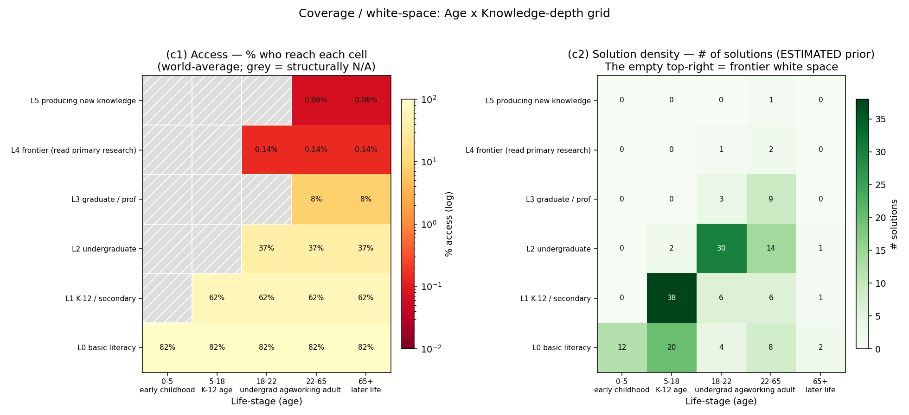

# 02 — Quantifying Knowledge Access on the Age × Knowledge-Depth Grid

### A data-science measurement of *who can reach how deep into knowledge*, and where the access cliff is

_education-atlas landscape analysis. Generated by `analysis/landscape/build_access.py`
→ `results.json`; figures by `make_figures.py`; headline numbers pinned by
`test_access.py`. Real anchors are World Bank EdStats (enrollment, literacy),
UNESCO UIS (researchers-per-million), ITU (internet by age), and the
research-atlas corpus. Constructed scales and every modeled cell are flagged
explicitly below._

---

## 0. The question

Education debates usually measure *enrollment* — are children in a classroom?
This analysis asks a harder question: **for a person of a given age, how deep
into a body of knowledge can they actually go?** And the inverse: **what fraction
of humanity ever reaches the frontier — the place where new knowledge is read,
let alone produced?**

We lay the question on a grid:

- **X = Age / life-stage**: `0-5` · `5-18` · `18-22` · `22-65` · `65+`
- **Y = Knowledge depth**: a constructed 6-rung ladder
  - **L0** basic literacy / numeracy
  - **L1** K-12 / secondary
  - **L2** undergraduate
  - **L3** graduate / professional
  - **L4** frontier — reading primary research
  - **L5** producing new knowledge

The deliverable is a measured *surface* over that grid, split by income tier,
overlaid with solution density, and reduced to four headline findings.

---

## 1. The constructed scale (read this before trusting any cell)

The **two axes are not measured by any authoritative body** — they are an
analytical frame this project defines in `analysis/landscape/scale.py`. What is
real is the **access proxy** mapped to each rung:

| Depth | Meaning | ISCED | Access proxy | Real / Estimated |
|-------|---------|-------|--------------|------------------|
| **L0** | basic literacy/numeracy | — | Adult literacy rate (`SE.ADT.LITR.ZS`) | **Real** (World Bank) |
| **L1** | K-12 / secondary | 1–3 | Secondary net enrollment (`SE.SEC.NENR`) | **Real** (World Bank) |
| **L2** | undergraduate | 6 | Tertiary gross enrollment (`SE.TER.ENRR`) | **Real** (World Bank) |
| **L3** | graduate / professional | 7–8 | Tertiary GER × graduate-entry share | Real base **× estimated** multiplier |
| **L4** | frontier (read primary research) | — | Researchers per million (`SP.POP.SCIE.RD.P6`) | **Real anchor** (UNESCO UIS) |
| **L5** | producing new knowledge | — | L4 × active-publishing share | Real anchor **× estimated** multiplier |

A second constructed object is the **age×depth structural mask**
(`AGE_DEPTH_OPEN`): you cannot be at undergraduate depth at age 3, so cells
outside a level's reachable life-stage are marked **structurally N/A** (greyed,
not zero). This is a modeling decision, documented in code.

**Why split L4 and L5.** L4 = *reaching* the frontier (being a researcher, able
to read primary literature). L5 = *adding* to it (publishing). The data shows
them as almost the same sliver — which is itself the finding.

---

## 2. Method

1. **Real surface (L0–L2).** For each World Bank indicator, take the
   latest-available value per country, then the mean within each income group
   (High / Upper-mid / Lower-mid / Low). Pure measurement, no modeling.
   (`build_access.load_income_surface`)
2. **L3 (graduate).** Multiply the real tertiary GER by a documented
   graduate-entry share per tier (`0.30` HIC → `0.06` LIC), anchored on OECD
   *Education at a Glance* graduate-entry rates. **Real base × estimated factor.**
3. **L4 (frontier).** Take UNESCO UIS *researchers per million inhabitants* by
   income group (documented group means), divide by 1e6, ×100 → a % of
   population. **Real anchor.**
4. **L5 (production).** L4 × `0.45` (share of researchers who actively publish).
   **Estimated multiplier on the real L4 anchor.**
5. **World-average row.** Unweighted mean of the four tiers (chosen for
   transparency over a population weighting whose weights would themselves be
   modeled).
6. **Solution density.** Read `data/landscape/solutions.csv` if the sibling
   solution-landscape exists; otherwise use a **documented density prior** that
   encodes the known EdTech market shape (dense at K-12 / consumer-undergrad,
   sparse at the frontier). Flagged as estimated when the CSV is absent.
7. **Corroboration.** The research-atlas slim DB supplies the real global
   researcher population as an independent cross-check on the frontier slice.

Everything is deterministic and idempotent: re-running reproduces `results.json`
byte-for-byte from the same inputs.

---

## 3. The four findings (with graphs)

### Finding 1 — The access cliff is **down the depth axis**, not across age


`analysis/landscape/figures/fig_access_vs_age.png`

World-average access by depth (real for L0–L2):

| Depth | World access |
|-------|-------------|
| L0 basic literacy | **82.5%** |
| L1 K-12 / secondary | **62.4%** |
| L2 undergraduate | **37.4%** |
| L3 graduate / professional | 8.1% *(est)* |
| L4 frontier | **0.14%** *(real anchor)* |
| L5 producing new knowledge | 0.06% *(est)* |

The y-axis is **logarithmic** because the drop is otherwise invisible: from
undergraduate (37%) to frontier (0.14%) is a **~270×** fall. Within a life-stage,
access barely changes with age (lifelong access keeps the lines flat); the cliff
is the *vertical* distance between rungs. **Depth, not age, is the binding
constraint.**

### Finding 2 — The equity gradient: income decides depth


`analysis/landscape/figures/fig_income_surface.png`

Real World Bank values, latest per country, by income tier:

| Depth | High | Upper-mid | Lower-mid | Low | HIC÷LIC |
|-------|------|-----------|-----------|-----|---------|
| L0 literacy | 97.2% | 94.4% | 79.7% | 58.7% | 1.7× |
| L1 secondary | 88.8% | 76.8% | 54.7% | 29.2% | 3.0× |
| **L2 undergrad** | **68.8%** | 49.1% | 21.9% | **9.7%** | **7.1×** |
| L3 graduate *(est)* | 20.6% | 8.8% | 2.2% | 0.6% | ~34× |
| **L4 frontier** *(real)* | **0.42%** | 0.12% | 0.027% | **0.0055%** | **~75×** |

The gradient **widens with depth**. At L0 the rich-poor gap is under 2×; by the
frontier it is ~75×. Tertiary access (L2) alone runs **80% in high-income vs
single digits in low-income** systems — the textbook equity gap, confirmed in
this dataset at **68.8% vs 9.7%**. (Learning poverty corroborates from the other
direction: 14.2% HIC vs 89.8% LIC — nine in ten low-income children can't read at
10, so the L0 line is itself optimistic about *real* depth.)

### Finding 3 — Coverage white-space: the top-right is empty



`analysis/landscape/figures/fig_coverage_heatmap.png`

Two panels over the same age×depth grid:

- **(c1) Access** — % who reach each cell (world-average; structurally-N/A cells
  hatched grey). The surface is hot (high access) along the bottom and cold
  (≪1%) along the top two rows at *every* age.
- **(c2) Solution density** — where education solutions cluster. Dense at the
  K-12 cell (L1 × 5-18) and consumer-undergrad (L2 × 18-22); **the L4/L5 ×
  working-adult corner is nearly empty.**

The two panels rhyme: the cells with the worst access (frontier) also have the
fewest solutions. _Solution density here is a **documented estimated prior** — no
`data/landscape/solutions.csv` was present at generation time; the script picks
up the real CSV automatically once the sibling solution-landscape ships._

### Finding 4 — Consume vs. create: ~0.1% of humanity ever produces new knowledge


`analysis/landscape/figures/fig_frontier_bar.png`

The single most dramatic number in the analysis:

> **World researchers per million ≈ 1,360 → ~0.136% of people are at the
> knowledge frontier. ~99.86% only ever consume.**

And it is steeply unequal: **0.42% (High income) vs 0.0055% (Low income) — a
~75× gap** in who even reaches L4. L5 (actually publishing) is smaller again.

**Real cross-check (research-atlas):** the research corpus holds **1,438,636
distinct researchers**, of whom **320,879 are currently active** publishers — an
independent, bottom-up confirmation that the population *producing* knowledge is
~10⁶, i.e. a fraction of a percent of the ~8×10⁹ humans. The two methods (UNESCO
per-capita anchor and the OpenAlex corpus headcount) agree on the order of
magnitude.

---

## 4. Dimension 5 — the depth ceiling of a *typical* person

The median depth a typical member of each tier actually reaches (highest rung
with ≥50% access):

| Income tier | Depth ceiling of the median person |
|-------------|-----------------------------------|
| High income | **L2** (undergraduate) |
| Upper-middle | L1 (secondary) |
| Lower-middle | L1 (secondary) |
| Low income | **L0** (basic literacy) |

**No income tier's typical person reaches graduate depth (L3) or beyond.** Even
in the richest countries, the median adult's ceiling is "some undergraduate
exposure"; the frontier (L4/L5) is not a ceiling anyone's *median* approaches —
it is reached by a sub-1% tail everywhere.

---

## 5. The access channel — internet by life-stage

Depth is gated not only by schooling but by the channel to reach it. ITU 2023
global online shares by age band (real anchor, coarse bins):

| Age | Online share |
|-----|-------------|
| 0-5 | 0% (mediated by caregiver) |
| 5-18 | 60% |
| 18-22 | 75% |
| 22-65 | 65% |
| 65+ | 40% |

The largest age digital divide is at **65+** — exactly the life-stage with the
most time for lifelong, self-directed depth. The channel narrows where the
opportunity is widest.

---

## 6. What's real vs. estimated (the honesty ledger)

| Component | Status | Anchor / assumption |
|-----------|--------|---------------------|
| L0 / L1 / L2 access, all tiers | **REAL** | World Bank EdStats, latest per country |
| Learning poverty, enrollment context | **REAL** | World Bank EdStats |
| Researchers per million (L4) | **REAL anchor** | UNESCO UIS `SP.POP.SCIE.RD.P6` group means |
| Researcher corpus headcount | **REAL** | research-atlas `research_atlas_slim.duckdb` |
| Internet by age | **REAL anchor** | ITU *Facts & Figures 2023*, coarse global bins |
| L3 graduate access | Real base **× estimated** | tertiary GER × OECD graduate-entry share (0.30→0.06) |
| L5 production | Real anchor **× estimated** | L4 × 0.45 active-publishing share |
| Solution density | **ESTIMATED prior** | documented EdTech market-shape prior (no CSV yet) |
| Age×depth structural mask | **CONSTRUCTED** | `AGE_DEPTH_OPEN` reachability rules |
| Depth ladder L0–L5, age bins | **CONSTRUCTED** | `scale.py` analytical frame |

**Known limitations.** (1) The depth ladder is an analytical construct, not an
ISCED-exact mapping. (2) World-average rows are unweighted tier means, not
population-weighted. (3) `SP.POP.SCIE.RD.P6` group means are documented anchors,
not pulled live from the cache (the education-atlas WB cache does not include the
R&D series); they are conservative relative to widely-cited figures (world
~1,360/M). (4) Solution density is illustrative until the sibling
solution-landscape CSV exists. (5) Data sparsity is worst exactly where access is
worst — every low-income number is a lower bound (see `EDUCATION_PROBLEMS.md §5`).

---

## 7. Headline

> **Education's binding constraint is depth, not age, and it is bought by income.**
> Access falls ~270× from undergraduate (37%) to the research frontier (0.14%);
> the rich-poor gap widens from under 2× at literacy to ~75× at the frontier; no
> income tier's typical person reaches graduate depth; and **~0.136% of humanity
> ever reaches the frontier where new knowledge is produced — ~99.86% only ever
> consume it.** The age×depth grid's entire top-right corner — deep knowledge for
> ordinary adults — is the white space, in both access and solutions.

---

## 8. Reproduce

```bash
cd analysis/landscape
python3 build_access.py        # -> results.json
python3 make_figures.py        # -> figures/*.png
python3 -m pytest test_access.py -q   # pins the headline numbers
```

Files: `analysis/landscape/scale.py` (constructed axes),
`build_access.py` (analysis), `make_figures.py` (figures),
`results.json` (output), `test_access.py` (regression guard).
