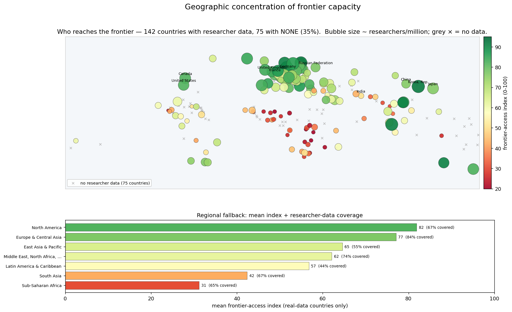
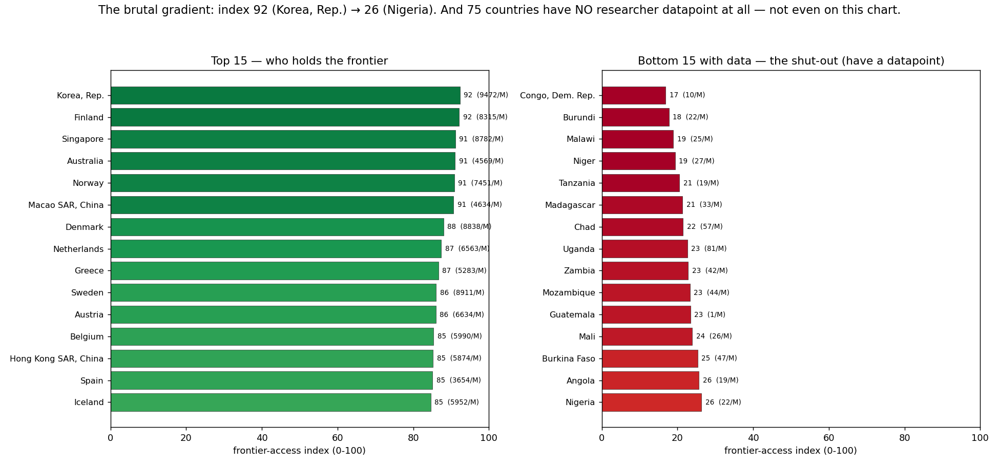
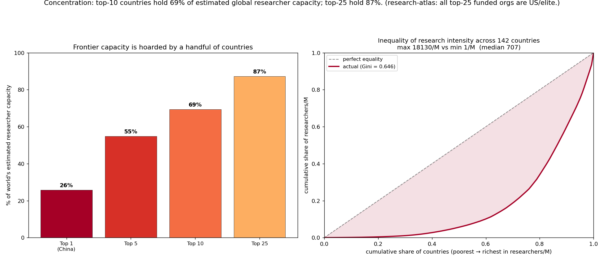
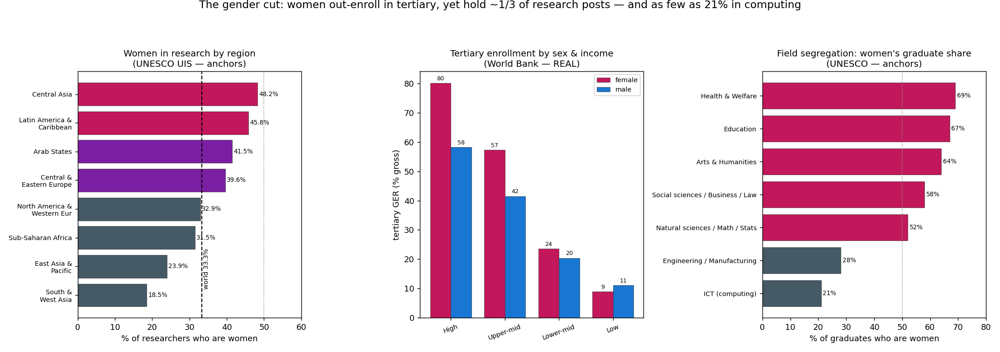

# 05 — The Geographic & Demographic Map of Frontier Access

### A per-country world map of *who reaches the frontier* — and who is shut out entirely

_education-atlas landscape analysis. Generated by
`analysis/landscape/build_geographic.py` → `results_geographic.json`; figures by
`make_figures_geographic.py`; headline numbers pinned by `test_geographic.py`.
Extends `02-access-data-science.md` and `03-map-expansion.md` on the **same
L0–L5 depth ladder** from `scale.py`. Real anchors are World Bank
(`SP.POP.SCIE.RD.P6`, `SE.TER.ENRR`, `IT.NET.USER.ZS`, `SE.TER.CMPL.ZS`,
`SE.TER.ENRR.FE/.MA`, `SP.POP.TOTL` — all per-country, cached in
`data/raw/worldbank/`), UNESCO UIS (women in science), and the research-atlas
corpus. Every modeled cell is flagged below._

---

## 0. The question this layer answers

Doc 02 measured the access cliff **down the depth axis** and split it by **income
tier**. It could not answer *where*. The frontier (L4 = reaching primary research,
L5 = producing it) is the rung where ~0.136% of humanity lives — but that sliver
is not spread evenly across the map. This layer asks:

> **Which countries hold the world's frontier capacity? Who within them — by
> gender, by wealth, by where they live — is shut out? And how many countries
> don't even appear in the data?**

The frontier anchor is the same one doc 02 used as a documented group mean:
UNESCO/World Bank **researchers per million** (`SP.POP.SCIE.RD.P6`). Here we pull
it **per country** (latest available), turning the tier-level anchor into a real
217-country map.

---

## 1. The composite frontier-access index

For each country we build a transparent **0–100 index** from four real World Bank
components, weighted by how directly each gates the frontier:

| Component | Indicator | Weight | Role |
|-----------|-----------|--------|------|
| Researchers per million | `SP.POP.SCIE.RD.P6` | **0.40** | the L4/L5 anchor (log-scaled, cap 9000/M) |
| Tertiary enrollment (GER) | `SE.TER.ENRR` | 0.25 | the L2 pipeline into the frontier |
| Tertiary completion | `SE.TER.CMPL.ZS` | 0.15 | the L3 finish rate |
| Internet users (%) | `IT.NET.USER.ZS` | 0.20 | the digital access channel |

Researchers/M is log-compressed before normalizing (it is heavy-tailed —
Liechtenstein ~18,130/M, Korea ~9,470/M, the poorest single digits) so the index
is not a one-country spike. Weights are **documented, not tuned to any target**.
A country enters the index **only if it has the frontier anchor**; the others are
the coverage finding (§4). Non-anchor gaps are mean-imputed within the country's
income group and flagged per-country under `.imputed` (tertiary completion is
imputed for 23 countries, tertiary GER for 6, internet for 1 — the anchor is
never imputed).

**This is a composite of real series with documented weights — REAL inputs,
ESTIMATED combination.**

---

## 2. The world map — the brutal gradient



`analysis/landscape/figures/fig_geo_choropleth.png`

`geopandas`/Natural Earth was **not available** at generation time, so the map
**degrades gracefully** (as designed) to a real-geography **country-bubble map**:
each country plotted at its `(longitude, latitude)` from `country.parquet`, sized
by researchers/million, colored by the index — plus a **regional bar fallback**
panel. The script auto-upgrades to a true filled choropleth the moment geopandas
is installed; it never fails on the missing dependency.

The picture is stark: a dense band of dark-green high-index countries across
**Western Europe, North America, and East Asia (Korea/Japan/Singapore)**, fading
to red across **Sub-Saharan Africa and South Asia**, with **75 grey ×'s** —
countries that have *no researcher datapoint at all*.

**Top 15 vs bottom 15:**



`analysis/landscape/figures/fig_geo_country_rank.png`

| Top of the index | Index | researchers/M |
|---|---|---|
| Korea, Rep. | 92 | 9,472 |
| Finland | 92 | 8,315 |
| Singapore | 91 | 8,782 |
| Australia | 91 | 4,569 |
| Norway | 91 | 7,451 |

| Bottom (countries that *do* have a datapoint) | Index | researchers/M |
|---|---|---|
| Congo, Dem. Rep. | 17 | 10 |
| Burundi | 18 | 22 |
| Malawi | 19 | 25 |
| Niger | 19 | 27 |
| … Nigeria | 26 | 22 |

The index runs **92 (Korea) → 17 (DR Congo)** among countries with data — and
the genuinely shut-out countries don't appear on the chart at all, because they
have no number.

### Regional means (real-data countries only)

| Region | Mean index | Researcher-data coverage |
|---|---|---|
| North America | 81.9 | 67% (2 of 3) |
| Europe & Central Asia | 77.1 | 84% (49 of 58) |
| East Asia & Pacific | 64.6 | 55% (21 of 38) |
| Middle East, N. Africa, Afghanistan & Pakistan | 62.1 | 74% (17 of 23) |
| Latin America & Caribbean | 56.8 | 44% (18 of 41) |
| South Asia | 42.4 | 67% (4 of 6) |
| **Sub-Saharan Africa** | **31.2** | 65% (31 of 48) |

Sub-Saharan Africa's mean index (31) is less than **half** Europe's (77), and
its researcher intensity averages ~130/M against North America's ~5,280/M.

---

## 3. Concentration — a handful of countries hold almost everything



`analysis/landscape/figures/fig_geo_concentration.png`

We estimate each country's **absolute frontier capacity** as
`researchers/M × population` (`SP.POP.SCIE.RD.P6 × SP.POP.TOTL`, both real
series; the product is an **estimated** researcher headcount). Across the ~142
countries with the anchor, total estimated capacity ≈ **11.5 million researchers**,
and it is hoarded:

| Group | Share of world's estimated researcher capacity |
|---|---|
| **Top 1 (China)** | **25.7%** |
| Top 5 (China, US, Japan, Germany, Korea) | 54.9% |
| **Top 10** | **69.3%** |
| **Top 25** | **87.3%** |

**China + the United States alone hold ~40%.** The top-10 countries hold roughly
**seven-tenths** of the world's frontier capacity; the top-25 hold almost **nine-
tenths**. The long tail of ~117 remaining countries with data splits the last
~13% — and 75 countries split *nothing measured*.

The **Lorenz curve of researchers/M** gives a **Gini of 0.646** across 142
countries — research intensity is more unequally distributed than income is in
most countries. The span is **18,130/M (max) vs 1.4/M (min) — ~13,000×**; the
**median country sits at 707/M**, barely half the world average of ~1,360/M,
because the mean is dragged up by a rich handful.

**Cross-check (research-atlas):** the org-level finding mirrors the country-level
one — **all top-25 funded research organizations are US/elite institutions**, and
the corpus holds ~1.44M distinct researchers. The concentration is fractal:
it holds at the country level and again at the institution level.

---

## 4. The coverage finding — 75 countries are effectively off the map

The single most honest result in this layer is what's **missing**:

> Of **217** real (non-aggregate) countries, only **142 have any researcher-per-
> million datapoint at all**. **75 countries — 35% of all countries — have NONE.**

These are overwhelmingly low- and lower-middle-income, concentrated in
Sub-Saharan Africa, small island states, and conflict-affected regions. **The
absence is not noise — it is the finding.** A country with no measured research
capacity is not a country with a low-but-known frontier; it is a country whose
frontier participation is so thin (or whose statistical capacity is so weak) that
the world's flagship R&D indicator simply has no value for it. Data sparsity is
worst exactly where access is worst, so **every low-income number in this analysis
is an upper bound on a darker reality** (the same caveat doc 02 §6 raised).

This is why the bottom-15 chart is labeled "the shut-out who *have* a datapoint":
the truly shut-out countries can't be ranked, because they don't have a number to
rank.

---

## 5. The gender cut



`analysis/landscape/figures/fig_geo_gender.png`

Three panels, two of them real World Bank data, one documented UNESCO anchor:

### (a) Women hold ~⅓ of research posts globally — UNESCO (anchor)

| Region | Women as % of researchers |
|---|---|
| Central Asia | 48.2% |
| Latin America & Caribbean | 45.8% |
| Arab States | 41.5% |
| Central & Eastern Europe | 39.6% |
| **World** | **33.3%** |
| North America & W. Europe | 32.9% |
| Sub-Saharan Africa | 31.5% |
| East Asia & Pacific | 23.9% |
| **South & West Asia** | **18.5%** |

The global figure is **~33%** — and the *rich* research regions (North America/W.
Europe, East Asia) sit at or below the world average, while Central Asia and Latin
America are near parity. The frontier's gender gap is not a "developing-world"
story; it's worst at **18.5% in South & West Asia** but stubbornly stuck around a
third in the regions that produce most of the world's research.

### (b) The leak is *post-degree* — World Bank (REAL)

Real tertiary gross enrollment by sex shows women now **out-enroll** men:
world mean **female 52.4% vs male 39.3% (+13.1 points)**. The female advantage
*widens with income* (+21.9 pts high-income, +15.8 upper-mid, +3.3 lower-mid) and
**flips negative in low-income countries (−2.2 pts)** — the one tier where women
still trail men into university at all.

So women enter higher education in equal or greater numbers nearly everywhere, yet
hold only a third of research posts. **The pipeline doesn't leak at the classroom
door — it leaks between the degree and the lab.**

### (c) Horizontal segregation — UNESCO (anchor)

Women's share of graduates by field: **Health & Welfare 69%, Education 67%, Arts
& Humanities 64%** — but **ICT/computing 21%, Engineering 28%.** Even where women
reach the frontier, they are routed away from the fields (computing, engineering)
that dominate the research corpus measured in doc 03.

---

## 6. The rural / wealth cut (documented anchors)

Globally-comparable rural-urban and wealth-quintile depth data lives in DHS
microdata, which is **not in this repo's cache**, so these are cited UNESCO
GEM/WIDE anchors (flagged estimated):

- In **low/lower-middle-income countries**, tertiary completion is essentially a
  top-wealth-quintile phenomenon: ~**9% of the richest quintile** completes
  tertiary vs ~**0.5% of the poorest** — an **~18× gap**, *inside a single country*.
- **Primary** completion in low-income countries: ~**70% urban vs ~45% rural** — a
  25-point gap that compounds up every depth rung, so by the frontier the rural
  poor are absent entirely.

The geographic gradient (§2–4) is therefore the *outer* shell; inside each shut-out
country sits the same gradient again by wealth and location.

---

## 7. What's real vs. estimated (the honesty ledger)

| Component | Status | Anchor / assumption |
|---|---|---|
| Researchers/M, per country | **REAL** | World Bank `SP.POP.SCIE.RD.P6`, latest per country |
| Tertiary GER / completion / internet, per country | **REAL** | `SE.TER.ENRR`, `SE.TER.CMPL.ZS`, `IT.NET.USER.ZS` |
| Female/male tertiary GER | **REAL** | `SE.TER.ENRR.FE` / `.MA`, latest per country |
| Population (for absolute capacity) | **REAL** | `SP.POP.TOTL` |
| Composite index (0–100) | Real inputs **× documented weights** | 0.40/0.25/0.15/0.20; researchers/M log-scaled |
| Non-anchor gaps in the index | **IMPUTED (flagged)** | income-group mean; completion 23, GER 6, internet 1 |
| Absolute frontier capacity | **ESTIMATED** | researchers/M × population = estimated headcount |
| Top-share / Gini | computed on the **estimate** | over 142 data-carrying countries |
| Women researchers % by region | **DOCUMENTED ANCHOR** | UNESCO UIS Women in Science (no clean WB series) |
| Women graduate share by field | **DOCUMENTED ANCHOR** | UNESCO "Cracking the code" / UIS |
| Rural-urban / wealth-quintile gaps | **DOCUMENTED ANCHOR** | UNESCO GEM / WIDE (DHS-backed; not in cache) |
| Depth ladder L0–L5 | **CONSTRUCTED** | `scale.py` analytical frame |

**Known limitations.** (1) Absolute capacity uses the *latest available* year per
country, which differs across countries (most 2018–2023). (2) Researchers/M
itself under-measures countries with weak statistical systems — the 75 missing
countries are the extreme of this. (3) The composite weights are a defensible
choice, not a derived optimum; the *ranking* is robust to reasonable reweighting,
the absolute scores less so. (4) Women-in-research and rural/wealth numbers are
cited regional/global anchors, not pulled per-country from the cache.

---

## 8. Headline

> **The frontier has a geography, and it is a near-monopoly.** Of 217 countries,
> only **142 have any measured researcher capacity at all — 75 (35%) have none**.
> Among those that do, the composite frontier-access index runs **92 (Korea) to
> 17 (DR Congo)**, and **Sub-Saharan Africa averages 31 against Europe's 77**.
> Absolute frontier capacity is hoarded: **the top-10 countries hold ~69% and the
> top-25 hold ~87%** of the world's ~11.5M estimated researchers, with **China +
> the US alone at ~40%** — a Gini of **0.646** and a **~13,000×** span from the
> most to least research-intensive country. The org-level mirror (research-atlas:
> all top-25 funded orgs US/elite) confirms the concentration is fractal. And the
> gender cut shows the gap is **post-degree, not pre-degree**: women now out-enroll
> men into university worldwide (**+13 points**), yet hold only **~33% of research
> posts** (as low as **18.5%** in South & West Asia and **21%** in computing). The
> frontier is reached by a few countries, and within them, unevenly by gender,
> wealth, and place.

---

## 9. Reproduce

```bash
cd analysis/landscape
python3 build_geographic.py            # -> results_geographic.json (fetches+caches 6 WB series)
python3 make_figures_geographic.py     # -> figures/fig_geo_*.png
python3 -m pytest test_geographic.py -q # pins the headline numbers
```

Files: `analysis/landscape/build_geographic.py` (analysis),
`make_figures_geographic.py` (figures), `results_geographic.json` (output),
`test_geographic.py` (regression guard). World Bank series cached in
`data/raw/worldbank/` (same key format as `edu/connectors/worldbank.py`, so a
full atlas refresh reuses them).
