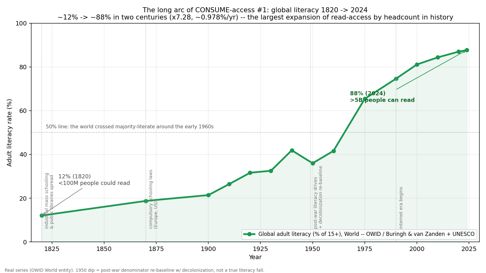
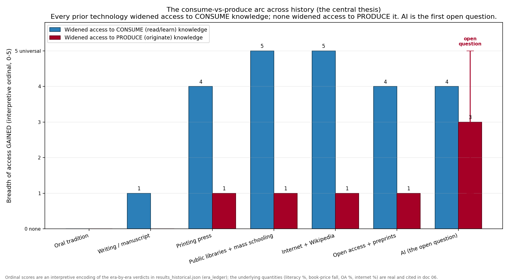

# 06 — The Historical Access Arc

### The long arc of knowledge *access*, era by era — and the one pattern that has never broken

_education-atlas landscape analysis. Generated by
`analysis/landscape/build_historical.py` → `results_historical.json`; figures by
`make_figures_historical.py` (`fig_literacy_longrun.png`, `fig_access_arc.png`).
This brief is the **time axis** of the knowledge-access gradient pushed back
across all of recorded history — the long-run complement to
`03-map-expansion.md`, whose temporal section ran only 2000→2024. It reuses the
**L0–L5 depth ladder** and the **consume-vs-produce distinction** built in
`02-access-data-science.md` and the master synthesis
`docs/THE-KNOWLEDGE-ACCESS-GRADIENT.md`. The long-run series are real cited
anchors; every era *verdict* is interpretive and flagged as such below._

---

## 0. Why a historical brief

Docs `02`–`05` photograph the knowledge-access gradient as it stands today: a
cliff down the depth axis, bought by income, gated by institutions, and an
emptiest-market top corner where ~0.14% of humanity reaches the frontier. Doc
`03` showed that *along one short slice of time* — 2000 to 2024 — the
read-access cliff is eroding fast (open access 12%→54%, internet 6.7%→68%). This
brief asks the longer question the rest of the corpus brackets: **across all of
recorded history, how has access to knowledge actually moved — and for whom?**

The reason to ask it historically is that the corpus's single most load-bearing
claim — that reaching the frontier and *producing* there are different problems,
and only the first is democratizing — is usually argued from a 24-year window.
If the claim is real, it should hold not just from 2000 to 2024 but from the
first clay tablet to the latest language model. It does. The whole arc of
knowledge technology, read end to end, tells one story with one exception
pending:

> **Every prior technology widened access to *consume* knowledge — to read,
> learn, and reach what others had already discovered. None widened access to
> *produce* it — to originate, validate, and add to the frontier. Reading the
> frontier is now nearly free; producing it remains gated. AI in the 2020s is
> the first technology for which that verdict is not yet written.**

This is the same consume-vs-produce gap doc `02` measures as a cross-section,
extended into a thesis about *technological history*. The two figures below
plot it: the long-run literacy curve (the headline case of consume-access
widening) and the era-by-era arc (the same thesis as an ordinal ledger).



`analysis/landscape/figures/fig_literacy_longrun.png`

---

## 1. Oral tradition — knowledge bounded by memory and mortality

For the overwhelming majority of human existence there was no external store of
knowledge at all. What a people knew, they held in living memory — in elders,
bards, ritual, song, and the trained recall of specialists. The Homeric epics,
the Vedas, the genealogies of pre-literate societies: all were transmitted by
mouth and ear, sometimes with astonishing fidelity, but always at the mercy of
the next generation's willingness and ability to memorize and retell.

On the consume/produce axis this era is the degenerate base case, because there
is no external medium to consume *from* and nothing that persists to add *to*.
Access was, in one narrow sense, universal — everyone in the group could in
principle hear and learn the tradition — but it was also strictly *bounded*: you
could only know what living memory could hold, and nothing survived a generation
it was not retold to. Anyone could contribute a story or a refinement, but the
contribution decayed; there was no cumulative frontier to stand on, only the
ceaseless re-transmission of a fixed inheritance. Plato's *Phaedrus* records
Socrates worrying that writing itself would *weaken* memory — a reminder that
each new knowledge technology has been received as a threat to the capacity it
was about to amplify, a pattern that recurs at every era boundary down to AI.

**Verdict:** neither consume- nor produce-access *scaled*. Knowledge was capped
by the size and lifespan of human memory. *(Interpretive; the framing is the
analysis's, the durability-of-oral-tradition facts are uncontroversial in the
literature.)*

---

## 2. Writing and the manuscript era — the first external store, gated to an elite

The invention of writing (~3200 BCE in Mesopotamia) is the first true inflection
in this entire arc: for the first time, knowledge could outlive the person who
held it and travel beyond the people who heard it. A law, a measurement, a proof
could be fixed and recovered. This is the moment external storage begins — and
with it, the first version of *consume-access*: the ability to read what someone
else, possibly long dead, had recorded.

But the widening was tiny, because two things gated it hard. The first was
literacy itself: through antiquity and the European Middle Ages the share of
people who could read was in the low single digits to perhaps ten percent at the
high end, concentrated in scribes, clergy, administrators, and aristocracy. The
second was the staggering cost of a copy. Every manuscript book was reproduced
by hand, one page at a time — a skilled scribe managed only a few pages a day,
so a single substantial codex represented months to years of labor, plus the
cost of parchment (which consumed whole animal herds for a large book). The
result is that a book in the manuscript era could cost the equivalent of a
craftsman's annual income or a small house. Knowledge had an external store, but
the store was a vault, and almost no one held the key.

Production was, if anything, *more* tightly held than consumption. New knowledge
was originated and curated inside monasteries, cathedral schools, and a handful
of courts; making even a *copy* — let alone an original work — required years of
trained labor and institutional sponsorship. The medieval university (Bologna
~1088, Paris and Oxford in the following century) professionalized scholarship
but did not democratize it; it built the first version of the credential gate
that doc `02` finds still standing at L3–L5 today.

**Verdict:** the arrival of external storage widened consume-access *slightly*
(knowledge could now persist and travel) but left both reading and producing
gated to a literate elite. The frontier existed, but it was a cloister.

---

## 3. The printing press (~1440) — the first great democratization, and the canonical case

Gutenberg's movable type, around 1440, is the hinge of the whole arc — and the
single cleanest demonstration of the thesis. It is the first technology that
collapsed the *cost of a copy* by orders of magnitude, and the consequences
fanned out across literacy, religion, science, and politics within a century.

The cost collapse is well measured. Between **1450 and 1500 the real price of a
book fell by roughly two-thirds** in the Low Countries, and by **~75% in England
between 1450 and 1530** — a sustained decline of roughly **−2.4% per year in raw
price (≈ −1.7%/yr quality-adjusted) for about a century** (Dittmar, 2011, *QJE*;
van Zanden). This is the largest one-shot collapse in the cost of a unit of
recorded knowledge before the internet. On the supply side, the throughput step
change was of the same order: a hand-copyist produced on the order of a few
pages a day, an early press on the order of a couple hundred — an ~80–100× jump
in copies per unit of labor. Output followed: Western Europe produced on the
order of a few hundred thousand to ~2.7 million *manuscript* books across the
entire fourteenth century, then roughly **12.6 million printed books by 1500**
(the incunabula era), and on the order of **10⁸ books in the sixteenth century
alone** (Buringh & van Zanden, 2009, *Journal of Economic History* 69(2):409–445).
Across the manuscript-to-print transition, the books-per-century count rose by
something like **four orders of magnitude**.

The knock-ons are the reason this era is canonical. Cheap books in the
*vernacular* drove literacy upward and broke the Latin-clergy monopoly on
reading. Dittmar's instrumented study finds that European cities which adopted a
printing press grew about **60% faster than otherwise-similar cities between 1500
and 1600** — the press was not just a cultural event but a measurable economic
one. Print was the diffusion layer of the Reformation (Luther's tracts spread
faster than any institution could suppress them) and a precondition for the
Scientific Revolution: reproducible figures, shared tables, and the rapid
circulation of results made cumulative, checkable science possible in a way the
hand-copied manuscript never could.

And yet — this is the whole point — the press barely moved *production* access.
It collapsed the cost of *copying and distributing* a work, so it amplified
*who could be read*. It did almost nothing for *who could originate*: an author
still needed literacy, a press or a printer's contract, and usually a patron or
capital. The printing press is the textbook instance of the thesis: a giant
jump in consume-access, a negligible jump in produce-access.

**Verdict:** the first great democratization of *reading*; the produce gate left
essentially intact. *(Cost-collapse and output figures are real economic-history
anchors; the consume-vs-produce reading is the analysis's interpretation.)*

---

## 4. Public libraries and mass schooling (19th c.) — consume-access goes from elite to majority

If the press democratized the *book*, the nineteenth century democratized the
*reader*. Two public institutions did it: tax-funded public libraries (the UK's
Public Libraries Act of 1850; the Boston Public Library, 1854; later the Carnegie
library wave) and, far larger in effect, **compulsory state schooling** — the
Prussian model that spread across Europe and was imported to the United States by
Horace Mann after 1843 (the same industrial model whose sorting logic doc `04`
and `THE-KNOWLEDGE-ACCESS-GRADIENT.md` §4 critique). Together they took reading
from a paid privilege to a public entitlement.

The headline number is the literacy curve in the figure above. Global adult
literacy ran about **12% in 1820** — fewer than 100 million people on Earth could
read and write — and stands at about **88% in 2024**, when more than 5 billion
people can (Our World in Data, *cross-country-literacy-rates*, built on Buringh &
van Zanden's historical estimates spliced to UNESCO modern data). That is a
**~7.3× rise in the rate over two centuries**, a compound growth of roughly
**~1%/yr**, and — because population grew enormously over the same span — **by
sheer headcount the single largest expansion of consume-access in human
history**. The world crossed the 50% majority-literate line around the early
1960s. (The visible dip around 1950 in the series is a denominator effect:
post-war decolonization re-baselined the world population that the rate is
computed over, not a true fall in the number of literate people — flagged in the
source and in `build_historical.py`.)

On the produce side, the nineteenth and twentieth centuries did something
genuinely two-edged. By making nearly everyone literate they vastly *expanded the
pool* from which producers of knowledge could be drawn — a precondition without
which the modern research enterprise is impossible. But at the same time the
modern research university and the professionalized PhD *enclosed* knowledge
production behind a credential. Producing validated knowledge became a licensed
occupation, with admission, training, affiliation, and funding gates — the
L3→L4→L5 stack doc `03` counts as 18 gates, 11 of them structural. So the era
that brought reading to the majority simultaneously made *producing* a
credentialed profession. The pool widened; the gate hardened.

**Verdict:** near-universal consume-access at the base (the literacy floor), and
a professionalized, credentialed enclosure of production. The arc's biggest
consume-access win and a structural produce-access *narrowing*, in the same
century.

---

## 5. The internet and Wikipedia (1990s–) — information abundance

The internet drove the marginal cost of a *copy* — the thing the press attacked
once and libraries attacked again — to essentially zero. Once a text is online,
it can be read by one more person for no additional cost, anywhere, instantly.
Global internet penetration went from effectively **0% in 1990 to about 68% in
2024** (~5.5 billion people online; World Bank / ITU `IT.NET.USER.ZS`), a roughly
**10× rise in the share online just since 2000** (6.7%→68%). Wikipedia, launched
2001, grew from zero to about **7 million English-language articles** and made a
free, instantly searchable encyclopedia — the bulk of recorded *reference*
knowledge — available to anyone with a connection.

This is consume-access at abundance: not just cheaper books but free, instant,
searchable everything-that-isn't-paywalled. It is the second-largest consume
inflection in the arc after mass literacy, and the fastest.

But it remained, overwhelmingly, a *reading* revolution. Yes, anyone could now
*publish a webpage*, and the web genuinely lowered the bar to broadcasting an
opinion or a tutorial. But *originating validated knowledge* — research that
survives scrutiny and adds to the frontier — stayed behind exactly the same
lab/credential/funding/peer-review gates it sat behind before the internet
existed. The internet let you read almost anything; it did not let you *do
science*. The produce-access rate at the frontier (doc `02`'s ~0.14% of
humanity) is unmoved by internet penetration.

**Verdict:** an abundance of consume-access; produce-access at the frontier
essentially unchanged. The pattern holds.

---

## 6. Open access and preprints (2000s–) — consume-access reaches the frontier for the first time

The open-access movement is the most important entry in this arc for one
specific reason: it is the first technology to extend consume-access all the way
to **L4 — reading the research frontier itself**. Every earlier widening reached
books, then reference works, then the open web; none of them, on their own, put
*primary, peer-reviewed and preprint research* in front of a person without an
institutional subscription. Open access did.

The numbers are in doc `03` and carried here on the same timeline: the
open-access share of new papers **quadrupled from 12% (2000) to 54% (2024)**,
crossing the 50% line in the early 2020s (OpenAlex / Unpaywall / Curtin COKI
bibliometrics). A stack of free infrastructure arrived alongside it — arXiv
(1991), Google Scholar (2004), the NIH PubMed Central mandate (2008), bioRxiv
(2013), Unpaywall and Semantic Scholar (2015), and OpenAlex (2022). For the first
time in history, a motivated person with no university affiliation can *read* the
edge of human knowledge for $0.

And — predictably, given everything above — it did **not** move production. The
moment open access threatened the subscription rent, the gate relocated to the
author side as article-processing charges: *Nature*'s open-access APC reached the
order of **$12,850 per article** (the figure the corpus pins from STAT's 2026
reporting; Springer Nature's own current list price for *Nature* is €10,850, with
*Nature Methods* at $12,690 — same order of magnitude, all flagged as
fast-moving). So open access excludes poor *authors* where subscriptions
excluded poor *readers*, and the prestige, affiliation, and funding gates are
entirely untouched. This is the cleanest modern restatement of the thesis: a
technology that pushed consume-access all the way up to the frontier while
leaving produce-access pinned at its historical rate.

**Verdict:** consume-access finally reached L4 (reading the frontier);
produce-access (L5) held at ~0.14% of humanity. *(OA and internet series are
real anchors; the APC figure is a real but fast-moving list price, cited with its
range.)*

---

## 7. AI (2020s–) — the first time the verdict is not yet written

Every era above resolves cleanly into the same verdict: consume-access widened,
produce-access did not. AI is the first entry where an honest analyst cannot yet
sign off on that line — and the corpus's job is to lay out *both* readings
without picking the winner the evidence does not yet support.



`analysis/landscape/figures/fig_access_arc.png`

**The case that AI is just another reading-amplifier.** On this view, large
language models are the most powerful consume-access tool ever built — and
nothing more. They lower the *comprehension* barrier that open access left
standing: AI can explain a paper, not just deliver it, which is a real and
genuinely new contribution to the L3→L4 bridge that doc `02` finds unbuilt. But
explaining the frontier is still *reading* it. The institutional machinery that
actually gates production — funding (NIH R01 success ~13%), a research position,
ethics approval, lab access, peer-review acceptance, the prestige economy, the
APC — is entirely outside what a chat box touches. On this reading, AI is to the
twenty-first century what the printing press was to the fifteenth: a spectacular
amplifier of *who can read and understand*, and almost no change to *who can
originate*. The early empirical record is consistent with caution — LLM-tutor
RCTs are short-term, facilitated, single-context (e.g. Nigeria ~0.31 SD), and the
deskilling / cognitive-offloading studies are early and contested (doc `02`,
`foundations/04`). The arc's null result has held for five thousand years; the
prior should be that it holds again.

**The case that AI is the first break in the pattern.** On this view, AI is
categorically different from every prior knowledge technology because it does not
merely *move* knowledge from store to reader — it can *operate* on it.
Hypothesis generation, literature synthesis at a scale no human can match,
autonomous experiment design and execution, code that runs analyses, and agents
that carry a problem from question to draft result are all *production* acts, not
reading acts. If even part of that holds, AI would be the **first technology in
the arc to widen access to producing knowledge** — to let a motivated,
non-institutional person actually *do* research rather than only consume it,
which is precisely the L3→L4→L5 white space the master synthesis names as the
highest-leverage region. The earliest gestures in this direction (research-agent
tools like Elicit for systematic review, FutureHouse/Edison for autonomous
discovery, the "autonomous science agents" milestone the doc `03` timeline marks
at 2024) are exactly the species of tool that could, in principle, push the red
bar up.

The honest position is that **both readings are defensible on current
evidence**, and the corpus refuses to resolve what the data cannot. The
deskilling studies are too thin to prove AI is *merely* a consumer; the
autonomous-science demonstrations are too early and too narrow to prove it is a
*producer*. What can be said precisely is what *would* count as a break in the
pattern: not faster reading, not better explanations, not more papers
summarized — those are consume-access wins the arc has delivered before — but a
measurable rise in the **rate at which non-institutional people originate
validated knowledge that survives scrutiny**. That rate, doc `02`'s ~0.14%, is
the number to watch. If AI moves it, the five-thousand-year pattern breaks for
the first time. If it doesn't, AI joins the printing press and the internet as
the next great amplifier of reading.

**Verdict:** the only era in the arc where the consume-vs-produce verdict is
*open*. *(Wholly interpretive. The corpus rates AI conditional, not solved.)*

---

## 8. The arc in one table

| Era | Approx. start | What changed | Who gained access | Consume-access | Produce-access |
|-----|---------------|--------------|-------------------|----------------|----------------|
| Oral tradition | pre-~3200 BCE | living memory only | the group, bounded by memory | does not scale | does not scale |
| Writing / manuscript | ~3200 BCE | first external store; hand-copied | a literate elite (<~10%) | **slight** ↑ (persists & travels) | narrowed to scribes/scholars |
| Printing press | ~1440 | movable type; cost of a copy collapses | the vernacular reading public | **large** ↑ (price −⅔ in 50 yrs; output ×10⁴/century) | barely moved |
| Public libraries + mass schooling | 19th c. | free libraries; compulsory schooling | the general population | **largest by headcount** ↑ (literacy 12%→88%) | pool ↑ but credential gate hardened |
| Internet + Wikipedia | 1990s | marginal cost of a copy → $0 | ~5.5B people online (68%) | **abundance** ↑ (internet 0→68%) | unchanged at the frontier |
| Open access + preprints | 2000s | free path to read primary research | anyone, no affiliation | ↑ **reaches L4** (OA 12%→54%) | unchanged (APCs re-gate authors) |
| AI | 2020s | models that *operate* on the corpus | anyone with a chat box | ↑ (also lowers comprehension barrier) | **open question** |

The consume-access column is an unbroken staircase up. The produce-access
column is flat — gated, narrowed, or unchanged — at every step until the last
one, where it becomes a question mark.

---

## 9. What's real vs. interpretive (the honesty ledger)

| Component | Status | Anchor / assumption |
|-----------|--------|---------------------|
| Global literacy 1820→2024 (12%→88%) | **REAL** | Our World in Data `cross-country-literacy-rates` (Buringh & van Zanden 2009 + UNESCO) |
| Book real-price fall (−⅔ 1450–1500; −75% 1450–1530 England) | **REAL** | Dittmar 2011 *QJE*; van Zanden |
| Printing-city growth +60% (1500–1600) | **REAL** | Dittmar 2011 *QJE* (instrumented on distance from Mainz) |
| Book output (~2.7M MS 14th c.; ~12.6M by 1500; ~10⁸ 16th c.) | **REAL order-of-magnitude** | Buringh & van Zanden 2009, *JEH* 69(2):409–445 |
| Internet 6.7%→68% (2000→2024); OA 12%→54% | **REAL anchors** | World Bank/ITU `IT.NET.USER.ZS`; OpenAlex/Unpaywall/COKI (reused from doc `03`) |
| Wikipedia ~7M en articles | **REAL** | Wikipedia statistics |
| *Nature* APC ~$12,850 | **REAL but fast-moving** | STAT 2026 (corpus pin); cf. Springer Nature list €10,850 / *Nature Methods* $12,690 |
| Medieval literacy <~10%; scribe vs press throughput | **REAL order-of-magnitude** | book-history scholarship; B&vZ |
| Era ledger *verdicts* (consume vs produce per era) | **INTERPRETIVE** | the analysis's reading of the cited facts |
| Ordinal scores in `fig_access_arc.png` | **INTERPRETIVE encoding** | ordinal labels for the era verdicts; the underlying quantities are real |
| AI consume-vs-produce verdict | **OPEN** | rated conditional, not solved (consistent with `02`, `foundations/04`) |

**Known limitations.** (1) The era boundaries are clean labels over a messy,
overlapping reality — oral tradition persists today, the manuscript era did not
end the day Gutenberg printed, and the eras co-exist. (2) The long-run literacy
and book series are Europe/West-leaning where the deep history is concerned (the
B&vZ corpus is European); the *shape* of the consume-access staircase generalizes,
the early absolute numbers are West-centric. (3) The 1950 literacy dip is a
denominator artifact of decolonization, not a true fall. (4) Every *verdict* in
the ledger is an interpretation, not a measurement — the underlying series are
real; the consume-vs-produce reading is the analysis's. (5) The AI row is
genuinely undecided and is presented as a two-sided open question, not a
prediction.

---

## 10. Headline

> **For five thousand years, every knowledge technology widened access to
> *consume* — to read, learn, and reach what was already known — and none widened
> access to *produce* it.** Writing gave knowledge an external store but gated it
> to a literate elite. The printing press collapsed the cost of a copy by orders
> of magnitude (book prices −⅔ in fifty years, output ×10⁴ per century) and lit
> the Reformation and the Scientific Revolution — but it amplified who could be
> *read*, not who could *originate*. Public libraries and mass schooling took
> literacy from ~12% (under 100 million people, 1820) to ~88% (over 5 billion,
> 2024), the largest consume-access expansion in history by headcount — while the
> modern university *enclosed* production behind a credential. The internet drove
> the cost of a copy to zero (0→68% online) and open access finally extended
> reading all the way to the research frontier (OA 12%→54%) — and still the rate
> at which humanity *produces* new knowledge held at ~0.14%. Reading the frontier
> is now nearly free; producing it remains gated behind 18 barriers, 11 of them
> structural. **AI is the first technology in the entire arc that *might* break
> the pattern — by letting people do research, not just read it — or might be the
> most powerful reading-amplifier ever built and nothing more. That verdict is not
> yet written; the number to watch is whether the produce-access rate moves.**

---

## 11. Reproduce

```bash
cd analysis/landscape
python3 build_historical.py          # -> results_historical.json
python3 make_figures_historical.py   # -> figures/fig_literacy_longrun.png, fig_access_arc.png
```

Files: `analysis/landscape/build_historical.py` (analysis + era ledger),
`make_figures_historical.py` (the two figures), `results_historical.json`
(output). Sibling docs: `02-access-data-science.md` (the access cliff,
consume-vs-produce cross-section), `03-map-expansion.md` (the 2000→2024 temporal
trend), `05-geographic-access.md` (the per-country frontier map), and the master
synthesis `docs/THE-KNOWLEDGE-ACCESS-GRADIENT.md`.

---

*Sources: Our World in Data, "Literacy" and the `cross-country-literacy-rates`
grapher (built on Buringh & van Zanden 2009 + UNESCO; CC-BY). Eltjo Buringh & Jan Luiten
van Zanden, "Charting the 'Rise of the West': Manuscripts and Printed Books in
Europe, A Long-Term Perspective from the Sixth through Eighteenth Centuries,"
*Journal of Economic History* 69(2): 409–445 (2009). Jeremiah Dittmar,
"Information Technology and Economic Change: The Impact of the Printing Press,"
*Quarterly Journal of Economics* 126(3): 1133–1172 (2011). World Bank / ITU
`IT.NET.USER.ZS` (internet penetration); OpenAlex / Unpaywall / Curtin COKI (open
access share). UNESCO Institute for Statistics (modern literacy). STAT News
(2026) and Springer Nature list prices (Nature-portfolio APCs). Plato, *Phaedrus*
(Socrates on writing and memory). Every long-run series is real and cited; every
era verdict is interpretive and flagged as such. Reproduce via
`analysis/landscape/build_historical.py` + `make_figures_historical.py`.*
