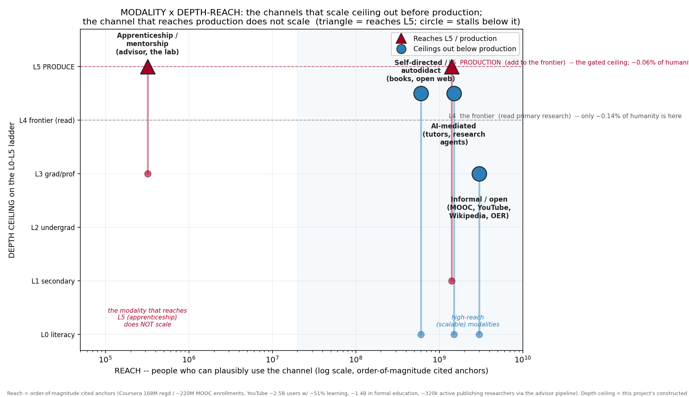

# 07 — The Modality Dimension

### How knowledge is actually *acquired* — the channel — and how far up the depth ladder each channel can carry a learner

_education-atlas landscape analysis. Figure by
`analysis/landscape/make_figures_modality.py` (`fig_modality_reach.png`). This
brief adds the **CHANNEL axis** to the knowledge-access gradient. It is
orthogonal to everything in docs `01`–`06`: those docs measure *where* the cliff
is (depth, income, geography, time, history) and *who occupies which cell*; this
one asks **through what channel** a person climbs the ladder at all, and how far
each channel can carry them. It reuses the **L0–L5 depth ladder** and the
**consume-vs-produce distinction** built in `analysis/landscape/scale.py`,
`02-access-data-science.md`, and the master synthesis
`docs/THE-KNOWLEDGE-ACCESS-GRADIENT.md`. Reach headcounts and completion rates
below are real cited figures; the depth-ceiling mapping onto the L0–L5 ladder is
this project's constructed analytical frame, flagged as such throughout._

---

## 0. Why a modality brief

The rest of the corpus answers *where* and *who*. It does not answer *how* — the
actual channel a learner uses to acquire knowledge. That channel turns out to be
the hidden variable behind the whole gradient, because **each modality has a
ceiling**: a depth on the L0–L5 ladder past which it cannot, in practice, carry a
motivated learner. A learner who only ever uses YouTube and Wikipedia does not
fail to reach the frontier because they lack ability; they fail because the
channel itself tops out two or three rungs below it.

So the modality axis decomposes the depth cliff into five questions, asked of
each channel:

- **(a) Depth reach** — how far up L0–L5 it can realistically carry a motivated
  learner.
- **(b) Cost** — what it costs to use.
- **(c) Scale / reach** — how many people the channel can serve.
- **(d) Credential** — whether it confers a recognized credential (the thing that
  opens the *next* institutional gate, per `04-knowledge-gatekeeping-and-what-works.md`).
- **(e) Production** — whether it can reach **L5**, the place where new knowledge
  is *added*, not just consumed.

The five modalities, ordered roughly from most-scalable to least:

1. **Formal** — school → university → graduate school. Credential-bearing,
   institutionally gated, the dominant path to L3–L5 today.
2. **Informal / open** — libraries, MOOCs (Coursera, edX), YouTube and
   educational video, podcasts, Wikipedia, open educational resources (OER).
   Enormous reach, low or zero cost, credential-light.
3. **Self-directed / autodidactic** — books, the open internet, self-study.
   Unbounded in principle, rare at the frontier in practice.
4. **Apprenticeship / mentorship** — the master–apprentice relationship, the PhD
   advisor. The actual path to L5; transfers tacit knowledge; does not scale.
5. **AI-mediated** — AI tutors and research agents. The emerging modality, and the
   wildcard.

> **The thesis of this brief:** the high-reach modalities (informal, open,
> self-directed) democratize **consumption** but ceiling out *before* the gated
> frontier; the one modality that reliably reaches **production** (apprenticeship,
> the lab) does not scale. Every prior modality has been either *scalable or
> capable of reaching production, never both*. **AI is the first candidate for a
> modality that is both** — a scalable channel (self-directed + AI) that might
> reach production for the first time. Whether it actually does is the open
> question doc `06` left pending, restated here in modality terms.

`analysis/landscape/figures/fig_modality_reach.png`

---

## 1. The modality × depth-reach mapping

The core table. **Depth ceiling** is the realistic ceiling for a *motivated*
learner using that channel as their primary means — not the floor, and not the
exceptional case (which §4 treats separately). The L0–L5 mapping is the
constructed ladder from `scale.py`; the reach and cost figures are cited.

| Modality | Depth reach (typical → ceiling) | Cost | Reach / scale | Credential? | Reaches L5 (production)? |
|---|---|---|---|---|---|
| **Formal** (school→uni→grad) | L1 → **L5** | High: ~$12k/yr+ grad; tuition stacks | ~1.4B in formal education worldwide [1] | **Yes** (the credential *is* the product) | **Yes** — the dominant path |
| **Informal / open** (MOOC, video, Wikipedia, OER) | L0 → **L2–L3 ceiling** | ~$0 / low | Coursera alone **168M** registered learners (2024) [2]; ~220M MOOC enrollments by 2021 [3]; YouTube ~2.5B users, **~51% use it to learn** [4] | Mostly no (certificates exist but weak signal) | **No** — stalls below the gated frontier |
| **Self-directed / autodidact** (books, open web) | L0 → **L4 edge** (L5 only exceptionally) | ~$0–low | Anyone literate with internet (~5B+); *frontier-reaching* autodidacts are vanishingly rare today | No | **Rarely** — historically yes, now nearly closed |
| **Apprenticeship / mentorship** (advisor, the lab) | L3 → **L5** | Implicit (a funded position) / very high per-head | Tiny: bounded by mentor time; ~320k active publishing researchers gate the next generation [5] | Yes (the PhD, the journeyperson card) | **Yes** — the actual path to production |
| **AI-mediated** (tutors, research agents) | L0 → **L4 edge** (L5 contested) | Low/marginal (~$0–20/mo) | Potentially universal (~1.5B+ already reachable) | No (not yet) | **Open question** — the wildcard |

Two facts jump off this table and define the whole brief:

1. **The credential column and the L5 column are the same column.** Every
   modality that confers a credential reaches L5; every modality that does not,
   does not (the AI row's blanks are exactly why it is the open question). The
   credential is not a coincidence — it is the *mechanism* by which a modality
   opens the next institutional gate (admissions, affiliation, funding) that doc
   `04` enumerates as 11 structural barriers. A channel that cannot issue a
   recognized credential cannot, by itself, walk a learner through those gates.

2. **Reach and production-reach are inversely related.** The channels that reach
   the most people (informal/open, ~10⁸–10⁹; self-directed, ~10⁹) top out at
   L2–L4; the channel that reaches L5 (apprenticeship) serves on the order of
   10⁵–10⁶. Formal education is the one channel that does both — and it does so by
   being a *funnel that sheds people at every rung* (doc `03` §3.4: 100 → 9.76 →
   0.077 across L0→L3→L5), so its "reaches L5" is true only for the thin survivor
   stream, not for its 1.4B headcount.

---

## 2. The high-reach modalities: democratized consumption, a hard L2–L3 ceiling

### 2.1 Informal / open — the largest expansion of *consume*-access in history, and its ceiling

The informal/open modality is the success story of the last twenty years, and the
single best illustration of why reach and depth-reach are not the same thing.

**The reach is staggering.** Coursera reported **168 million registered learners**
as of end-2024, up 19% year-over-year from 142M in 2023 [2]. Aggregate MOOC
enrollments across all platforms passed **220 million** by 2021, up from 120M in
2018 [3]. YouTube — the largest informal-learning channel on Earth — has roughly
2.5 billion users, and a 2018 Pew survey found **51% of users use it to learn how
to do things they have never done before** (87% rate it "important" for that) [4].
Wikipedia, OER, and educational podcasts add hundreds of millions more. This is
the modality behind doc `06`'s and doc `03`'s finding that *consume*-access is
democratizing fast.

**But it ceilings out at L2–L3, and the completion data is how we know.** The
defining statistic of the MOOC era is its attrition. A widely cited comparative
analysis finds completion rates ranging from **0.7% to 52.1% with a median of
~12.6%** [3]; most courses sit in the **3–15%** band [6], and one large analysis
found **3.13% of all participants completed in 2017–18, down from ~6% in 2014–15**
[7]. Even among *certificate-seeking* (most-motivated) learners, completion is
~22% versus ~6% for casual browsers [6]; over half of registrants never advance
past sign-up, and ~39% never perform any action in the course at all [3].

The honest reading is not "MOOCs failed" — 12% of 220M is still ~26M course
completions, a real democratization of *breadth*. The reading is that **the
modality is structurally a breadth-not-depth channel**: it delivers L0–L2 content
at planetary scale to self-selected, intermittent consumers, it issues a weak
credential at best, and **no informal/open product carries a learner across the
L3→L4 comprehension bridge** to the gated frontier (the white space doc `01`
identifies and doc `THE-KNOWLEDGE-ACCESS-GRADIENT.md` §6.2 names as highest
leverage). The ceiling is not a quality failure; it is the nature of the channel.

### 2.2 Why the ceiling is real, not incidental

Three properties cap the informal/open modality at L2–L3:

- **No credential, no next gate.** Per doc `04`, 11 of the 18 frontier gates are
  structural (admissions, affiliation, paywalls/APCs, funded position). A MOOC
  certificate clears none of them.
- **No tacit transfer.** The frontier runs on tacit lab knowledge — how to frame a
  question, run an instrument, survive peer review — that broadcast video cannot
  carry (§3).
- **Consumption, not production, is the affordance.** The channel is built to
  *deliver* finished knowledge to many, not to *originate* new knowledge with one.

---

## 3. Self-directed and apprenticeship: the two opposite failure modes

These two modalities are the poles of the scalability-vs-production tension, so it
is clarifying to read them together.

### 3.1 Self-directed / autodidact — unbounded in principle, nearly closed in practice

The autodidactic channel is, on paper, the only high-reach modality with **no
depth ceiling at all**. The open internet plus open access (54% of new papers by
2024, doc `03` §3.3) plus shadow libraries means a literate person with a
connection can, in principle, read all the way to L4 — the primary literature —
for ~$0. And history records that some of the deepest L5 *production* came from
autodidacts: **Michael Faraday** had almost no formal schooling and little
mathematics, taught himself by reading and attending public lectures, and produced
foundational electromagnetism [8]; **Srinivasa Ramanujan** was largely self-taught
from a single synopsis of theorems and reached the number-theory frontier with no
degree [9]. The autodidact-to-frontier path is *real* — it built part of the canon.

**So why is it nearly extinct now?** Because the two things that have *not*
democratized are exactly the two things the autodidact lacks:

1. **The frontier's tacit layer.** Faraday reached L5 through a *mentor* — he
   became Humphry Davy's assistant at the Royal Institution [8]. Ramanujan reached
   it through Hardy. The pure autodidact reaches L4 (reading) but the L4→L5 step
   has, historically, still required a master. The cases that look like "pure
   self-teaching to production" almost always have an apprenticeship hidden inside
   them.
2. **The structural gates got higher.** In Faraday's era the frontier had few
   formal gates. Today reaching L5 requires clearing the 18-gate stack of doc `04`
   — affiliation, funding, ethics approval, peer review, APCs up to $12,850 — none
   of which yields to reading alone. Reading the frontier is now free; *being
   admitted to produce at it* is gated tighter than ever.

So the self-directed modality has the highest theoretical ceiling (L4 edge,
L5-in-principle) and one of the lowest realized ceilings: it reliably carries the
motivated to **L2–L3**, occasionally to **L4 reading**, and to **L5 only in the
rare cases that secretly contain a mentor**. It is the channel of *unbounded
possibility and vanishing probability*.

### 3.2 Apprenticeship / mentorship — the only channel that reliably reaches L5, and it does not scale

Apprenticeship is the mirror image: a low theoretical *reach* but the **only
modality that reliably delivers production**. The PhD advisor relationship, the
master–journeyman trade, the lab postdoc — these transfer the **tacit knowledge**
that broadcast and self-study cannot: how to choose a tractable problem, run the
bench, read between a paper's lines, withstand review. This is why the people who
*produce* knowledge (~320k active publishing researchers, doc `02`; the
research-atlas counts 320,879 active publishers among 1.44M distinct researchers)
were almost all trained one-to-one by someone already inside.

The evidence that one-to-one mentored instruction is the most *effective* modality
is old and robust: **Bloom's "2 sigma problem"** found one-to-one mastery tutoring
produced learning ~2 standard deviations above conventional class instruction —
the tutored median above the 98th percentile of the class [10]. (Later systematic
reviews put the durable, scalable figure closer to ~0.5σ for mastery learning
alone and ~0.25–0.37σ for tutoring at scale [10], doc `04` §6.1 — the 2σ was
inflated by ideal conditions. But even the deflated number is the largest
reliable lever known.)

**And it does not scale.** That is Bloom's entire point: tutoring works, but its
cost is its headcount ceiling. The supply of L5-capable mentors is bounded by the
existing L5 population, each of whom can apprentice only a handful at a time. The
formal apprenticeship data shows the same scarcity even at the trade level: U.S.
Registered Apprenticeship completion rates run **below ~35%** [11], so even the
institutionalized version of the channel sheds most entrants — though those who
complete do well (~91% retain employment; ~$49.8k starting journeyperson wage
[11]). The channel that reaches production is, structurally, the channel that
cannot reach scale.

**This is the load-bearing tension of the whole brief:** *the modality that
scales (informal/open) cannot reach production; the modality that reaches
production (apprenticeship) cannot scale.* Every modality in human history has
been on one side of this line or the other. Formal education is the partial
exception only because it bolts a scalable front end (mass schooling, L1–L2) onto
an apprenticeship back end (the PhD, L3–L5) — and pays for it by shedding 99.9% of
entrants before the back end (doc `03` §3.4).

---

## 4. AI-mediated: the wildcard — could a scalable modality reach production for the first time?

This is the modality doc `06` flagged as *the first technology for which the
consume-vs-produce verdict is not yet written*, restated here as a structural
question: **can AI be the first channel that is both scalable AND reaches
production?**

The case that it might break the tension rests on what AI does to the two things
that capped self-directed learning (§3.1): it is a candidate **scalable substitute
for the tacit-transfer and comprehension functions** that previously required a
mentor.

- **As a scalable tutor (the L3→L4 bridge).** The strongest early evidence is
  promising and narrow. A 2025 Harvard physics RCT (Kestin et al.) found students
  using a *carefully engineered, pedagogically principled* AI tutor learned **more
  than double** the active-learning control, with reported effect sizes of
  **~0.73–1.3σ** — but over only **two weeks**, with **194 Harvard
  undergraduates**, on **middle-order** cognitive skills, with **no long-term
  retention data**, and explicitly *not* a generic chatbot [12]. The Stanford
  *Tutor CoPilot* RCT (>700 tutors, ~1,000 students) found a more modest **+4
  percentage points** topic mastery, larger (+9 pp) for students of weaker tutors —
  notably a *human-AI* system, not AI-alone [13]. Read against the discipline of
  doc `04` (~0.3σ is "substantial"; the Nigeria LLM-tutor RCT was 0.31σ), the
  honest verdict is: real, repeatable gains at the **L1–L3 consumption** range,
  evidence thinning fast above that, and the strongest results coming from
  *engineered* or *human-paired* systems, not raw consumer chatbots. AI is, so
  far, a powerful **consumption amplifier** — which would make it just the next
  informal/open channel, with a higher ceiling but the same kind of ceiling.

- **As a research agent (the L5 question).** The genuinely new possibility is the
  research-agent: tools (Elicit, FutureHouse/Edison, autonomous science agents
  since 2024, doc `03` §3.3) that perform *parts of production* — systematic
  review, hypothesis generation, even autonomous experimental loops. If a
  self-directed learner plus a research agent can clear the *epistemic* parts of
  L5 (framing, method, validation) without a human mentor, then for the first time
  a **scalable** modality touches **production**. That is the upside the doc `06`
  figure encodes as AI's contested "produce" bar.

**The honest two-sided verdict** (and it must stay two-sided — doc
`foundations/04` rates AI-in-education equity-ambivalent, the evidence too thin to
license confident prediction):

- **Downside case — AI is just informal/open with a better ceiling.** It amplifies
  *consumption*, raises the autodidact's realized ceiling from L2–L3 toward L4, and
  changes nothing about the 11 structural gates (affiliation, funding, peer review,
  APCs) that wall off L5. The cognitive-offloading literature even warns it could
  *lower* depth-reach by letting learners outsource the desirable difficulties that
  produce durable learning. On this reading AI moves the blue circle up a little
  and the line still stops below the red.
- **Upside case — AI is the first scalable production modality.** It substitutes
  for the tacit-transfer function that only apprenticeship provided, lets a
  self-directed learner reach the L3→L4 comprehension bridge unaided, and — via
  research agents — performs enough of L5's epistemic work that *production* stops
  requiring a human mentor and a funded position. On this reading the line crosses
  L5 for a high-reach channel for the first time in history.

The structural fact that makes this *worth* arguing: AI is the only modality that
attacks **both** of the autodidact's two missing pieces at once — the comprehension
bridge (as tutor) and the tacit production layer (as research agent). Whether it
clears the *non-epistemic* gates (affiliation, funding, peer-review acceptance,
APCs) is a question about institutions and economics, not about the model — which
is exactly why doc `THE-KNOWLEDGE-ACCESS-GRADIENT.md` §6.2 pairs the AI bridge with
an author-routed production-economics lever. **The model can carry a learner to the
edge of production; only changing the gates lets them through it.**

---

## 5. Synthesis: modality is how the consume-vs-produce gap is *built*

Reassembled, the modality axis explains *mechanically* the central finding of the
whole corpus — that ~99.86% of humanity only consumes knowledge and ~0.14% reaches
where it is produced (doc `02` §2.3):

| | Scalable (reaches 10⁸–10⁹) | Does not scale (10⁵–10⁶) |
|---|---|---|
| **Reaches production (L5)** | *empty — the historic impossibility* | Apprenticeship / the lab |
| **Ceilings below production** | Informal/open, self-directed, (AI today) | Formal's failed-funnel majority |

The top-left cell — a modality that is *both* scalable *and* production-reaching —
has been **empty for all of recorded history**. That empty cell *is* the
consume-vs-produce gap. The reason 99.86% only consume is that the only channels
that reach most people stop at consumption, and the only channel that reaches
production cannot reach most people.

**AI is the first serious candidate to fill the empty cell.** It is the only
modality that is natively scalable (marginal cost ~$0, reach ~10⁹) *and* attacks
the specific functions — comprehension-bridging and tacit production-transfer —
that previously confined production to the non-scalable apprenticeship channel. If
it fills that cell, it does not merely widen consumption (every prior technology
did that); it changes *which kind of access is scarce*. If it does not, it joins
the long line of consumption amplifiers — books, radio, MOOCs, YouTube — that
democratized breadth and left the gated frontier exactly where it was.

That is the modality restatement of doc `06`'s pending verdict, and it sharpens
the reform implication of `THE-KNOWLEDGE-ACCESS-GRADIENT.md` §6: the highest-leverage
move is not to build *another* high-reach consumption channel (that cell is full),
but to build the scalable-production channel that has never existed — a
self-directed + AI modality deliberately engineered as the L3→L4 comprehension
bridge and the L4→L5 production assistant, paired with an economics that opens the
non-epistemic gates. **The modality data says the prize is not more consumption
reach; it is the first channel that scales all the way to production.**

---

## 6. Limitations

- **The depth-ceiling mapping is constructed.** Where each modality "tops out" on
  the L0–L5 ladder is this project's interpretive judgment (the L0–L5 ladder
  itself is the constructed frame of `scale.py`), not a measured quantity. The
  *reach* headcounts and *completion rates* are real and cited; the ceiling
  placements encode the cited evidence but are not themselves a measurement.
- **Reach figures are order-of-magnitude and not comparable units.** "168M Coursera
  registrations," "~2.5B YouTube users of whom ~51% learn," "~1.4B in formal
  education," and "~320k active researchers" measure different things (cumulative
  registrations vs active users vs enrolled stock vs producing headcount). The
  figure uses them as *orders of magnitude* for scale, not as a like-for-like
  ranking.
- **The AI evidence is genuinely early** (the corpus-wide caveat). The Kestin RCT
  is two weeks, single-institution, middle-order skills, engineered tutor; Tutor
  CoPilot is human-AI not AI-alone; deskilling studies are correlational or
  small-n. This brief rates AI *conditional and contested*, not solved — exactly as
  docs `04`, `06`, and `foundations/04` do.
- **Anglophone / STEM lean.** MOOC, apprenticeship, and AI-tutor evidence is
  heavily US/OECD and STEM-weighted; the autodidact cases are Western-canon. The
  *shape* of the modality tension generalizes; the specific numbers carry the
  corpus's standing geographic and disciplinary lean.
- **Modalities blend in reality.** Real learners braid channels (a formal student
  who self-studies on YouTube and uses an AI tutor). The table treats each as a
  *primary* channel for analytic clarity; the §3.1 point that "pure" autodidacts
  usually contain a hidden apprenticeship is the clearest case of why the pure
  categories are idealizations.

---

## Sources

- **[1]** UNESCO Institute for Statistics / global enrollment stock — ~1.4B
  learners in formal education worldwide (primary through tertiary, order of
  magnitude). Consistent with the access proxies in `analysis/landscape/results.json`.
- **[2]** Coursera Q4/FY2024 financial results — 168M registered learners, +19%
  YoY. https://investor.coursera.com/news/news-details/2025/Coursera-Reports-Fourth-Quarter-and-Full-Year-2024-Financial-Results/default.aspx
- **[3]** Open Praxis, "Uncovering MOOC Completion: A Comparative Study of
  Completion Rates from Different Perspectives" (2024) — median ~12.6% completion
  (range 0.7–52.1%); ~220M MOOC enrollments by 2021; >50% never pass sign-up; ~39%
  never act. https://openpraxis.org/articles/10.55982/openpraxis.16.3.606
- **[4]** Pew Research Center, "Many Turn to YouTube for Children's Content, News,
  How-To Lessons" (2018) — 51% of users use YouTube to learn how to do new things;
  87% rate it important. https://www.pewresearch.org/internet/2018/11/07/many-turn-to-youtube-for-childrens-content-news-how-to-lessons/
- **[5]** OpenAlex / research-atlas headcount — 1,438,636 distinct researchers;
  320,879 active publishers (the L5 mentor pool), via doc `02` §2.3.
- **[6]** University of Michigan / Teachers College–Columbia summaries — certificate
  seekers ~22% vs casual ~6% completion; most MOOCs 3–15%. https://record.umich.edu/articles/research-shows-certificates-boost-mooc-completion-rates/
- **[7]** Inside Higher Ed / MIT-Harvard edX analysis — 3.13% of all participants
  completed in 2017–18, down from ~6% in 2014–15. https://www.insidehighered.com/digital-learning/article/2019/01/16/study-offers-data-show-moocs-didnt-achieve-their-goals
- **[8]** Michael Faraday — largely self-taught, little formal math, reached the
  frontier via assistantship to Humphry Davy at the Royal Institution. (List of
  autodidacts, Wikipedia; standard biography.)
- **[9]** Srinivasa Ramanujan — self-taught from G.S. Carr's synopsis, reached the
  number-theory frontier without a degree. https://www.britannica.com/biography/Srinivasa-Ramanujan
- **[10]** Benjamin Bloom, "The 2 Sigma Problem" (Educational Researcher, 1984);
  Nintil systematic review — one-to-one mastery tutoring ~2σ in ideal conditions,
  ~0.5σ (mastery) / ~0.25–0.37σ (tutoring at scale) durable. https://journals.sagepub.com/doi/10.3102/0013189X013006004 · https://nintil.com/bloom-sigma/
- **[11]** U.S. Department of Labor / Apprenticeship.gov & Center for American
  Progress — Registered Apprenticeship completion <~35%; ~91% retain employment;
  ~$49.8k journeyperson wage. https://www.americanprogress.org/article/wage-gaps-outcomes-apprenticeship-programs/ · https://www.apprenticeship.gov/data-and-statistics
- **[12]** Kestin et al., Harvard physics AI-tutor RCT (Scientific Reports, June
  2025) — ~0.73–1.3σ vs active learning; 194 students, 2 weeks, middle-order
  skills, engineered tutor. Review: https://etcjournal.com/2025/11/10/review-of-kestin-et-al-s-june-2025-harvard-study-on-ai-tutoring/
- **[13]** Stanford NSSA, "Tutor CoPilot: A Human-AI Approach for Scaling Real-Time
  Expertise" — +4 pp topic mastery (+9 pp for weaker tutors), >700 tutors / ~1,000
  students. https://nssa.stanford.edu/studies/tutor-copilot-human-ai-approach-scaling-real-time-expertise

_Cross-references: `docs/THE-KNOWLEDGE-ACCESS-GRADIENT.md` (master synthesis,
consume-vs-produce thesis §2.3, white space §6.2); `02-access-data-science.md`
(the L0–L5 cliff, ~0.14% frontier); `03-map-expansion.md` (§3.4 the funnel, §3.3
democratizing reading not production); `04-knowledge-gatekeeping-and-what-works.md`
(the 18 gates, what-works effect sizes); `06-historical-access-arc.md` (the
consume-vs-produce arc and AI as the first open question);
`analysis/landscape/scale.py` (the constructed L0–L5 ladder)._
